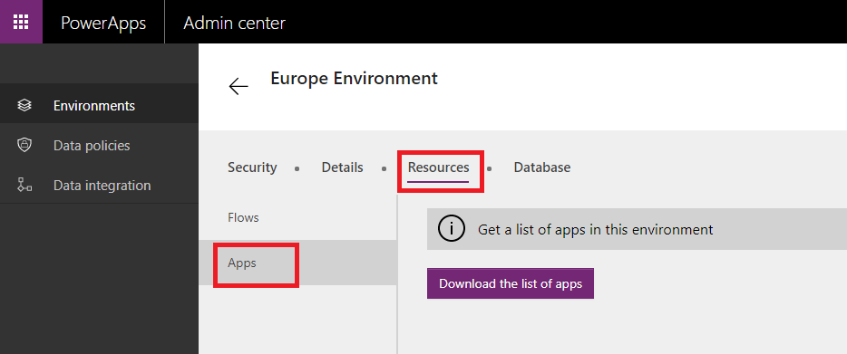

# Snelstartgids: een lijst downloaden met de apps die in uw omgevingen zijn gemaakt
Als u een omgevingsbeheerder bent, kunt u een lijst bekijken en downloaden met de apps die zijn gemaakt in de omgevingen die u beheert. Als u een globale beheerder van Office 365 of tenantbeheerder van Azure Active Directory bent, kunt u een lijst bekijken en downloaden met de apps die in alle omgevingen in uw organisatie zijn gemaakt.

In deze snelstartgids leert u hoe u een lijst met de apps die in één omgeving zijn gemaakt, kunt downloaden naar een CSV-bestand, dat u vervolgens in Excel kunt bekijken.

## Vereisten
 Als u de stappen in deze snelstartgids wilt volgen, zijn de volgende items vereist:
 * Een licentie voor PowerApps Plan 2 óf voor Microsoft Flow Plan 2. U kunt zich ook aanmelden voor een [gratis proefversie van een PowerApps-abonnement 2](https://web.powerapps.com/signup?redirect=marketing&email=).
 * Machtigingen voor omgevingsbeheerder van PowerApps, globale beheerder van Office 365 of tenantbeheerder van Azure Active Directory. Zie het Engelstalige artikel [Environments administration in PowerApps](environments-administration.md) (Omgevingen beheren in PowerApps) voor meer informatie.

## Aanmelden bij PowerApps-beheercentrum
Meld u aan bij het beheercentrum op [https://admin.powerapps.com]([https://admin.powerapps.com).

## De lijst met apps downloaden
1. Tik of klik in het navigatiedeelvenster op **Omgevingen** en klik of tik op de omgeving waarvoor u de lijst met apps wilt downloaden.

    
2. Klik of tik op het tabblad **Resources** op **Apps** en klik of tik op **Lijst met apps downloaden**.

    

    De lijst met apps wordt gedownload naar een CSV-bestand. Dit proces kan enkele minuten duren. Zorg ervoor dat u het venster pas sluit als de lijst volledig is gedownload. Anders kan het zijn dat u het proces opnieuw moet starten.

## De lijst bekijken
Nadat het CSV-bestand is gemaakt, opent u het in Excel. De lijst bevat de weergavenaam van de app, de eigenaar van de app, eventuele connectors die de app gebruikt om verbinding met gegevensbronnen te maken en andere informatie.

## Volgende stappen
In deze snelstartgids hebt u geleerd hoe u een lijst kunt downloaden en bekijken met de apps die in een omgeving binnen uw organisatie zijn gemaakt. Hierna leert u hoe u de apps kunt beheren die in uw organisatie zijn gemaakt.

> [!div class="nextstepaction"]
> [De apps beheren die in uw organisatie zijn gemaakt](admin-manage-apps.md)
