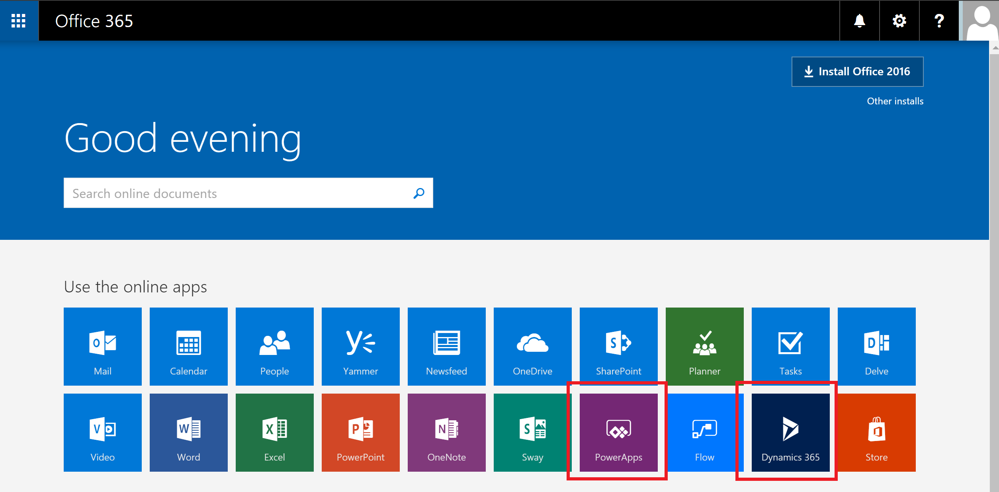
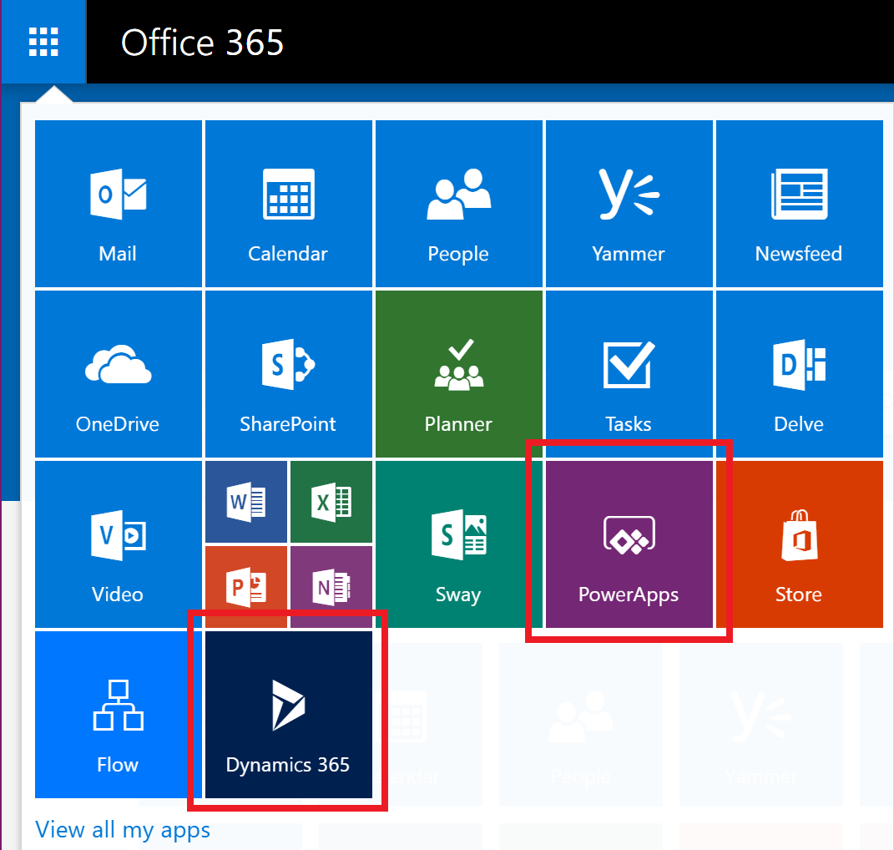

# Licenties in uw organisatie beheren
Dit onderwerp beschrijft hoe gebruikers in uw organisatie toegang kunnen krijgen tot PowerApps en hoe u de toegang tot de PowerApps-service kunt beheren.

## Aanmelden voor PowerApps
### Wat is PowerApps?
Met Microsoft PowerApps kunnen gebruikers toepassingen maken voor mobiele apparaten met Windows, iOS en Android. Met behulp van deze apps kunt u verbindingen maken met veelgebruikte SaaS-services, waaronder Twitter, Office 365 Dropbox en Excel.

### Hoe kunnen gebruikers zich aanmelden voor PowerApps?
De enige optie waarbij afzonderlijke gebruikers in uw organisatie zich kunnen aanmelden is de proefversie van het PowerApps-abonnement 2. Gebruikers kunnen zich hiervoor aanmelden via de PowerApps-website:

##### Optie 1
Gebruikers kunnen zich aanmelden door naar [powerapps.microsoft.com](https://powerapps.microsoft.com) te gaan, daar **Gratis aanmelden** te selecteren en vervolgens het registratieproces voor PowerApps te doorlopen via [portal.office.com](https://portal.office.com/Start?sku=powerapps).

##### Optie 2
Gebruikers kunnen zich aanmelden door naar [powerapps.microsoft.com](https://powerapps.microsoft.com) te gaan, **Aanmelden** te selecteren en zich aan te melden met hun werk- of schoolaccount en zich vervolgens aan te melden voor de proefversie van het PowerApps-abonnement 2 door de gebruiksvoorwaarden voor PowerApps te accepteren.    

Wanneer een gebruiker in uw organisatie zich aanmeldt voor PowerApps, krijgt die gebruiker automatisch een PowerApps-licentie toegewezen.

> [!NOTE]
> Gebruikers die zich vanuit PowerApps aanmelden voor een proeflicentie, worden niet weergegeven in de Office 365-beheerportal als PowerApps-abonnement 2-proefversiegebruikers (tenzij ze beschikken over een andere licentie voor Office 365, Dynamics 365 of PowerApps).

Bezoek [Aanmelding voor PowerApps via selfservice](../maker/signup-for-powerapps.md) voor meer informatie.

### Hoe kunnen gebruikers in mijn organisatie toegang krijgen tot PowerApps?
Gebruikers in uw organisatie kunnen op drie verschillende manieren toegang krijgen tot PowerApps:

* Ze kunnen zich afzonderlijk aanmelden voor een proefversie van PowerApps-abonnement 2, zoals wordt beschreven in het hoofdstuk [Hoe kunnen gebruikers zich aanmelden voor PowerApps?](#how-do-users-sign-up-for-powerapps)
* U kunt ze een PowerApps-licentie toewijzen vanuit de Office 365-beheerportal.
* Er is een Office 365- en/of Dynamics 365-abonnement aan een gebruiker toegewezen met toegang tot de PowerApps-service. Zie de [pagina met prijzen van PowerApps-licenties](https://powerapps.microsoft.com/pricing) voor de lijst met Office 365- en Dynamics 365-abonnementen met PowerApps-mogelijkheden.

### Kan ik voorkomen dat gebruikers in mijn organisatie zich aanmelden voor PowerApps?
Iedereen kan de functies van Microsoft PowerApps-abonnement 2 30 dagen gratis proberen, zoals beschreven in het hoofdstuk [Hoe kunnen gebruikers zich aanmelden voor PowerApps?](#how-do-users-sign-up-for-powerapps)  Deze optie is beschikbaar voor elke gebruiker in een tenant en kan niet worden uitgeschakeld door een beheerder.  Na het verstrijken van de proefversie heeft de gebruiker geen toegang meer tot de mogelijkheden van PowerApps-abonnement 2.  

Als iemand zich aanmeldt voor een proefversie van 30 dagen voor Microsoft PowerApps-abonnement 2 en u ervoor kiest deze persoon daar niet bij te ondersteunen, kan dit niet leiden tot kosten voor uw bedrijf. Wanneer een persoon zich aanmeldt voor Microsoft PowerApps, is dit een rechtstreekse overeenkomst tussen deze persoon en Microsoft, zoals bij veel openbare cloudservices van Microsoft het geval is, zoals Bing, Wunderlist, OneDrive of Outlook.com. Dit impliceert op geen enkele wijze dat de service door uw organisatie wordt aangeboden.

Tot slot is het mogelijk om het gebruik van bedrijfseigen gegevens in Microsoft PowerApps te beperken, door middel van beleid ter preventie van gegevensverlies (DLP). Zie [Data loss prevention (DLP) policies (Beleid ter preventie van gegevensverlies)](prevent-data-loss.md) voor meer informatie.

## Beheer van PowerApps
### Waarom is het pictogram PowerApps verschenen in het startprogramma voor Office 365-apps?
Zoals in augustus is aangekondigd, is Microsoft PowerApps nu een fundamenteel onderdeel van het Office 365-pakket. Drie maanden na deze aankondiging is Microsoft PowerApps ingeschakeld als een service die onderdeel uitmaakt van bestaande Office 365-SKU's. Omdat gebruikers overal ter wereld nu gebruik kunnen maken van Microsoft PowerApps, wordt dit pictogram nu weergegeven in het startprogramma voor apps. Raadpleeg het [Licentie-overzicht](pricing-billing-skus.md) voor meer informatie over welke Office 365-SKU's nu PowerApps omvatten.

Bekijk het volgende hoofdstuk als u de PowerApps-tegel standaard wilt verwijderen uit het startprogramma voor apps.

### Hoe verwijder ik PowerApps bij bestaande gebruikers?
Als er een licentie voor PowerApps-abonnement 1 of 2 is toegewezen aan een gebruiker, kunt u met behulp van de volgende stappen de PowerApps-licentie voor die gebruiker verwijderen:

1. Ga naar het [Office 365-beheerportal](https://portal.microsoftonline.com/).

2. Selecteer in de navigatiebalk **Gebruikers** en selecteer vervolgens **Actieve gebruikers**.

3. Zoek de gebruiker waarvoor u de licentie wilt verwijderen en selecteer vervolgens de naam.

4. Ga naar het blad met gebruikersgegevens en selecteer in de sectie **Productlicenties** de optie **Bewerken**.

5. Zoek de licentie **Microsoft PowerApps-abonnement 1** of **Microsoft PowerApps-abonnement 2**, stel de wisselknop in op **Uit** en selecteer vervolgens **Opslaan**.

    

Als een gebruiker toegang heeft tot PowerApps als onderdeel van een Office 365- en/of Dynamics 365-abonnement, kunt u aan de hand van de volgende stappen hun toegang tot de PowerApps-service uitschakelen:

1. Ga naar het [Office 365-beheerportal](https://portal.microsoftonline.com/).

2. Selecteer in de navigatiebalk **Gebruikers** en selecteer vervolgens **Actieve gebruikers**.

3. Zoek de gebruiker waarvoor u de toegang wilt uitschakelen en selecteer vervolgens de naam.

4. Ga naar het blad met gebruikersgegevens en selecteer in de sectie **Productlicenties** de optie **Bewerken**.

5. Vouw de gebruikerslicentie voor Office 365 of Dynamics 365 uit, schakel toegang tot de service **PowerApps voor Office 365** of **PowerApps voor Dynamics 365** uit en selecteer vervolgens **Opslaan**.

    

Bulksgewijs verwijderen van licenties is ook mogelijk via PowerShell. Zie [Remove licenses from user accounts with Office 365 PowerShell (Licenties verwijderen van gebruikersaccounts met Office 365 PowerShell)](https://technet.microsoft.com/library/dn771774.aspx) voor een gedetailleerd voorbeeld.   Ten slotte vindt u meer informatie over het bulksgewijs verwijderen van services binnen een licentie op de pagina [Disable access to services with Office 365 PowerShell (Uitschakelen van toegang tot services met Office 365 PowerShell)](https://technet.microsoft.com/library/dn771769.aspx).

Het verwijderen van de PowerApps-licentie of -service voor een gebruiker in uw organisatie zorgt er ook voor dat de pictogrammen voor PowerApps en Dynamics 365 voor die gebruiker worden verwijderd van de volgende locaties:

* [Office.com](https://office.com)

    
* Office 365 AppLauncher "waffle"

    

### Hoe kan ik voor mijn gebruikers de toegang tot bedrijfsgegevens via PowerApps beperken?
In PowerApps kunt u gegevenszones maken voor bedrijfsgegevens en andere gegevens, zoals hieronder weergegeven.  Wanneer deze beleidsregels ter preventie van gegevensverlies zijn geïmplementeerd, kunnen gebruikers geen PowerApps maken of uitvoeren die bedrijfsgegevens en andere gegevens combineren. Zie [Data loss prevention (DLP) policies (Beleid ter preventie van gegevensverlies)](prevent-data-loss.md) voor meer informatie.

### Waarom zijn er 10.000 licenties voor Microsoft PowerApps verschenen in mijn Office 365-tenant?
Omdat uw organisatie in aanmerking komt, kunnen gebruikers in uw organisatie Microsoft PowerApps-abonnement 2 30 dagen proberen. Deze proeflicenties vertegenwoordigen de beschikbare capaciteit voor nieuwe PowerApps-gebruikers in uw tenant. Aan deze licenties zijn geen kosten verbonden. Er zijn twee mogelijke redenen waarom er een capaciteit van 10.000 (evaluatieversie-)licenties voor PowerApps worden weergegeven in het Office 365-beheerportal:

* Als ten minste één gebruiker in uw tenant heeft deelgenomen aan de openbare preview van PowerApps die van april tot oktober 2016 liep, ziet u 10.000 licenties met het label 'Microsoft PowerApps and Logic flows'

    
* Als ten minste één gebruiker in uw tenant zich heeft aangemeld voor een proefversie van PowerApps-abonnement 2 door zich via **Optie 1** te registreren, zoals omgeschreven in het hoofdstuk [Hoe kunnen gebruikers zich aanmelden voor PowerApps?](#how-do-users-sign-up-for-powerapps), ziet u 10.000 licenties met het label 'Microsoft Power Apps & Flow'

    

U kunt zelf aanvullende licenties toewijzen aan gebruikers via de Office 365-beheerportal, maar houd er rekening mee dat dit licenties voor een proefversie van Microsoft PowerApps-abonnement 2 zijn die 30 dagen na het toewijzen aan een gebruiker verlopen.

### Is dit gratis? Worden er kosten in rekening gebracht voor deze licenties?
Deze licenties zijn gratis licenties voor een proefversie zodat uw gebruikers Microsoft PowerApps-abonnement 2 30 dagen gratis kunnen proberen.

### Heeft dit invloed op hoe ik nu identiteiten voor gebruikers in mijn organisatie beheer?
Als uw organisatie al een bestaande Office 365-omgeving heeft en alle gebruikers in uw organisatie Office 365-accounts hebben, verandert er niets aan het identiteitsbeheer.

Als uw organisatie al een bestaande Office 365-omgeving heeft, maar niet alle gebruikers in uw organisatie een Office 365-account hebben, maken we een gebruiker in de tenant en wijzen we licenties toe op basis van het werk- of school-e-mailadres van de gebruiker. Dit wil zeggen dat het aantal gebruikers dat u beheert, zal toenemen naarmate er meer gebruikers in uw organisatie zich aanmelden voor de service.

Als uw organisatie nog geen Office 365-omgeving aan uw e-maildomein heeft gekoppeld, verandert er niets aan uw identiteitsbeheer. Gebruikers worden toegevoegd aan een nieuwe gebruikersdirectory die alleen van toepassing is op clouddiensten en u kunt de rol van tenant-beheerder aannemen om de gebruikers te beheren.

### Wat is het proces voor het beheren van een tenant die door Microsoft voor mijn gebruikers is gemaakt?
Als een tenant is gemaakt door Microsoft, kunt u deze claimen en de tenant beheren met behulp van de volgende stappen:

1. Word lid van de tenant door u aan te melden voor PowerApps met een e-mailadresdomein dat overeenkomt met het tenant-domein dat u wilt beheren. Als Microsoft bijvoorbeeld de tenant contoso.com heeft aangemaakt, wordt u lid van de tenant met een e-mailadres dat eindigt op @contoso.com.
2. Claim beheerrechten door te verifiëren dat u het domein bezit: zodra u lid bent van de tenant, kunt u uzelf tot beheerdersrol promoveren door bezit van het domein te verifiëren. Hiervoor volgt u de volgende stappen:
3. Ga naar [https://portal.office.com](https://portal.office.com/Start?sku=powerapps).
4. Selecteer het pictogram van het startprogramma voor apps in de linkerbovenhoek en kies vervolgens Beheerder.
5. Lees de instructies op de pagina **Beheerder worden** en kies vervolgens **Ja, ik wil de beheerder worden**.  

> [!NOTE]
> Als deze optie niet wordt weergegeven, is er al een Office 365-beheerder.

### Kan ik beheren aan welke Office 365-tenant gebruikers worden toegevoegd, als ik heb meerdere domeinen heb?
Als u niets doet, wordt er een tenant gemaakt voor elk domein en subdomein dat hoort bij de e-mailadressen van uw gebruikers.

Als u wilt dat alle gebruikers worden toegevoegd aan dezelfde tenant, ongeacht het domein van hun e-mailadres:  

* Maak vooraf een tenant of gebruik een bestaande tenant. Voeg alle bestaande domeinen en subdomeinen die u wilt samenvoegen toe aan deze tenant. Alle gebruikers met een e-mailadres dat eindigt op deze domeinen en subdomeinen worden dan automatisch lid van de doel-tenant wanneer ze zich aanmelden.

> [!IMPORTANT]
> Er is geen ondersteuning voor een geautomatiseerd mechanisme om gebruikers over te plaatsen naar een andere tenants als deze eenmaal zijn gemaakt. Zie voor meer informatie over het toevoegen van domeinen aan een enkele Office 365-tenant, [Add your users and domain to Office 365 (Uw gebruikers en domein toevoegen aan Office 365)](https://support.office.com/article/Add-your-users-and-domain-to-Office-365-ffdb2216-330d-4d73-832b-3e31bcb5b2a7).
