# Een besturingselement toevoegen en configureren in PowerApps
U kunt een groot aantal verschillende UI-elementen toevoegen aan uw app en vervolgens direct aspecten van hun uiterlijk en gedrag configureren. Dit kan via de werkbalk, in het tabblad **Eigenschappen** of de formulebalk. Deze UI-elementen worden besturingselementen genoemd en de aspecten eigenschappen.

## Vereisten
1. [Registreer u](../signup-for-powerapps.md) voor PowerApps, [installeer](http://aka.ms/powerappsinstall) het, open het en meld u aan met dezelfde referenties die u hebt gebruikt om u te registreren.

2. Klik of tik in PowerApps Studio op **Nieuw** in het menu **Bestand** (aan de linkerkant).

    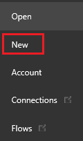

3. Klik of tik onder **Lege app** op **Telefoonindeling**.

    

4. Als u wordt voorgesteld de inleidende rondleiding te volgen, klikt of tikt u op **Volgende** om vertrouwd te raken met de belangrijkste gedeelten van de PowerApps-interface (of klik of tik op **Overslaan**).

    

    U kunt de rondleiding altijd later volgen door op het vraagtekenpictogram in de rechterbovenhoek te klikken of tikken en vervolgens op **Take the intro tour**.

## Een besturingselement toevoegen
U kunt besturingselementen uit allerlei verschillende categorieën toevoegen door eerst op de werkbalk te klikken of tikken op het tabblad **Invoegen**. Klik of tik vervolgens op een categorie en klik of tik ten slotte op het gewenste besturingselement. Bekijk in deze sectie de besturingselementen uit elke categorie, zodat u bekend bent met de typen besturingselementen die u kunt toevoegen en waar u een bepaald type kunt vinden.

Klik of tik op het tabblad **Invoegen** op een van deze categorieën en klik of tik vervolgens op het besturingselement dat u wilt toevoegen:

**Tekst**: label, tekstinvoer, HTML-tekst, peninvoer 
**Besturingselementen**: knop, vervolgkeuzelijst, datumkiezer, selectievakje, keuzerondje, wisselknop, schuifregelaar, classificatie, timer 
**Galerie**: verticaal, horizontaal, flexibele hoogte, leeg verticaal, leeg horizontaal, leeg flexibele hoogte 
**Gegevenstabel** 
**Formulieren**: bewerken, weergeven, formulier voor entiteit 
**Media**: afbeelding, camera, streepjescode, video, audio, microfoon, afbeelding toevoegen 
**Diagrammen**: kolomdiagram, lijndiagram, cirkeldiagram 
**Pictogrammen**

> [!TIP]
> Als u meer ruimte nodig hebt voor besturingselementen, [voegt u nog een scherm toe](add-screen-context-variables.md).

## Een besturingselement rechtstreeks configureren
In deze procedure gaat u een besturingselement van het type **Label** toevoegen en configureren, maar de procedure is in grote lijnen ook geschikt voor veel andere besturingselementen.

1. Klik of tik op het tabblad **Invoegen** en klik of tik vervolgens op **Label**.

    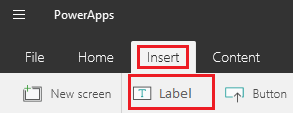

    Wanneer u een besturingselement toevoegt, wordt dit automatisch geselecteerd. U kunt ook een bestaand besturingselement selecteren door erop te klikken of tikken. Als een besturingselement is geselecteerd, ziet u een selectiekader om het element. Andere gebieden van de gebruikersinterface worden aangepast, zodat u het geselecteerde besturingselement kunt configureren. Een geselecteerd besturingselement van het type **Label** ziet er bijvoorbeeld uit zoals in deze afbeelding.

    

    > [!IMPORTANT]
> Als er een besturingselement is geselecteerd op het moment dat u een ander besturingselement of een leeg gebied van het scherm selecteert, wordt de selectie van het eerste element ongedaan gemaakt.
2. Maak het besturingselement **Label** smaller door een greep aan de rechterkant van het selectiekader naar links te slepen. (De middelste greep wordt alleen weergegeven als u inzoomt.)

    

     U kunt het formaat van een besturingselement ook wijzigen door de eigenschap **[Height](controls/properties-size-location.md)** of **[Width](controls/properties-size-location.md)** (of allebei) aan te passen. Dit wordt verderop beschreven.

3. Verplaats het besturingselement **Label** door het selectiekader zelf te slepen. U kunt ook de waarde voor **[X](controls/properties-size-location.md)** of **[Y](controls/properties-size-location.md)** (of allebei) aanpassen, zoals verderop in dit onderwerp wordt beschreven.

4. Klik of tik driemaal op de tekst die wordt weergegeven in het besturingselement **Label** en typ vervolgens **Hallo, wereld**.

    

     U kunt deze tekst ook wijzigen door de eigenschap **[Text](controls/properties-core.md)** van dit besturingselement in te stellen, zoals verderop in dit onderwerp wordt beschreven.

## Een besturingselement configureren via de werkbalk
Als u een besturingselement configureert via de werkbalk, kunt u uit meer opties kiezen dan bij een rechtstreekse configuratie van een besturingselement.

1. Selecteer het besturingselement **Label** en klik of tik op het tabblad **Start** op de werkbalk.

    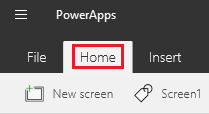

2. Klik of tik op **Opvullen**, en klik of tik vervolgens op een kleur zoals Aquamarijn.

    

    Uw selectie wordt toegepast op het besturingselement **Label**.

    

3. Wijzig het lettertype en de grootte van de tekst (bijvoorbeeld in 18 punts Georgia).

    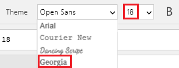

    Uw selectie wordt toegepast op het besturingselement **Label**.

    

4. Klik of tik op het tabblad **Label**, klik of tik op **Verticaal uitlijnen** en klik of tik op **Boven**.

    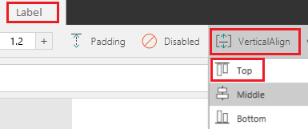

    Uw selectie wordt toegepast op het besturingselement **Label**.

    

## Een besturingselement configureren via het tabblad Eigenschappen
Met behulp van het tabblad **Eigenschappen** kunt u een besturingselement configureren zonder een formule te schrijven. In deze procedure gaat u een ander besturingselement van het type **Label** toevoegen en configureren, maar de procedure is in grote lijnen ook geschikt voor veel andere besturingselementen.

1. Voeg een ander besturingselement **Label** toe zoals eerder in dit onderwerp beschreven.

2. Selecteer het nieuwe besturingselement en klik of tik in het rechterdeelvenster op het tabblad **Eigenschappen**.

    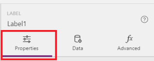

3. Typ in het **Tekst**vak **Tabblad Eigenschappen**.

    

    Het besturingselement **Label** geeft de opgegeven tekst weer.

    

4. Klik of tik in het deelvenster **Eigenschappen** op het pictogram **Vullen** en klik of tik vervolgens op een kleur.

    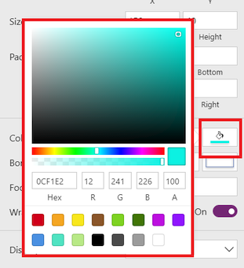

    Uw selectie wordt toegepast op het besturingselement **Label**.

    

5. Klik of tik in het deelvenster Eigenschappen op de eigenschap **Color**.

    

    De waarde van de eigenschap **Color** is gemarkeerd in de formulebalk.

    

6. Verwijder het tweede besturingselement **Label** door erop te klikken of tikken en vervolgens op Delete te drukken.

## Een besturingselement configureren via de formulebalk
Met behulp van de formulebalk kunt u eigenschappen instellen die u niet rechtstreeks, in het tabblad **Eigenschappen** of via de werkbalk kunt instellen. Zo kunt u op deze manier knopinfo instellen die wordt weergegeven wanneer een gebruiker het besturingselement aanwijst, maar er niet op klikt of tikt. U kunt ook complexe formules opgeven om de mogelijkheden van de app te vergroten.

Alle wijzigingen die u eerder in dit onderwerp hebt gemaakt, hebben ertoe geleid dat de waarde van een bepaalde [eigenschap](reference-properties.md) van het besturingselement is aangepast.

* Door het formaat van het besturingselement via slepen te wijzigen, is de waarde van de eigenschap **[Width](controls/properties-size-location.md)** aangepast.
* Door het besturingselement naar een andere positie te slepen, is de waarde van de eigenschappen **[X](controls/properties-size-location.md)** en **[Y](controls/properties-size-location.md)** gewijzigd.
* Door de tekst van het besturingselement rechtstreeks te wijzigen, is de eigenschap **[Text](controls/properties-core.md)** aangepast.

In plaats van een besturingselement rechtstreeks, in het tabblad **Eigenschappen** of via de werkbalk te configureren, kunt u de waarde van een eigenschap ook aanpassen door de eigenschap te selecteren in de lijst met eigenschappen en vervolgens een waarde op te geven op de formulebalk. Deze aanpak betekent dat u alfabetisch kunt zoeken naar eigenschappen, maar nog belangrijker is dat u meer mogelijkheden hebt.

1. Selecteer het resterende besturingselement **Label**, klik of tik op **[Text](controls/properties-core.md)** in de lijst met eigenschappen en typ vervolgens **"Mijn bedrijfsnaam"** (inclusief de aanhalingstekens) in de formulebalk.

    

    Wanneer u een tekenreeks tussen aanhalingstekens zet, geeft u aan dat de invoer exact moet worden weergegeven zoals u deze hebt getypt. Een andere mogelijkheid is om de waarde van een eigenschap in te stellen op een formule.

2. Selecteer het besturingselement **Label**, klik of tik op **[Text](controls/properties-core.md)** in de lijst met eigenschappen en typ vervolgens **Today()** (zonder aanhalingstekens) in de formulebalk.

    U ziet nu de huidige datum in het besturingselement.

    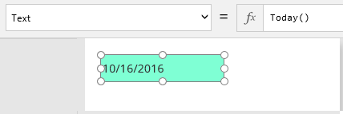

    > [!TIP]
> U kunt [verschillende notaties gebruiken voor datums en tijden](show-text-dates-times.md). Daarnaast kunt u berekeningen uitvoeren op datums en tijden.

## Twee besturingselementen configureren voor onderlinge interactie
In deze procedure gaat u een selectievakje toevoegen en vervolgens het eerder gemaakte label zo configureren dat dit vak alleen wordt weergegeven wanneer het selectievakje is ingeschakeld.

1. Klik of tik op het tabblad **Invoegen**.

    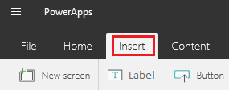

2. Klik of tik op **Besturingselementen**, en klik of tik vervolgens op **Selectievakje**.

    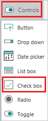

3. Plaats het besturingselement **Selectievakje** onder het besturingselement **Label** en stel de eigenschap **[Text](controls/properties-core.md)** van het besturingselement **Selectievakje** in op **Tekst weergeven**.

    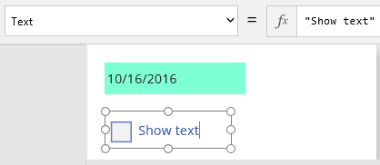

4. Met het besturingselement **Selectievakje** nog steeds geselecteerd, klikt of tikt u op de naam ervan boven het tabblad **Eigenschappen** en typt u vervolgens **Mijnselectievakje**

    

5. Klik of tik op het besturingselement **Label** om dat te selecteren.

6. Klik of tik in het tabblad **Eigenschappen** op de eigenschap **Visible**.

    

7. Verwijder **true** op de formulebalk, en typ of plak deze formule:

    **If(Mijnselectievakje.Value = true, true, false)**

    Deze **[If-functie](functions/function-if.md)** geeft aan dat het label alleen moet worden weergegeven wanneer het selectievakje is ingeschakeld. Omdat het selectievakje is uitgeschakeld, verdwijnt het besturingselement **Label** (het selectiekader is nog wel zichtbaar).

    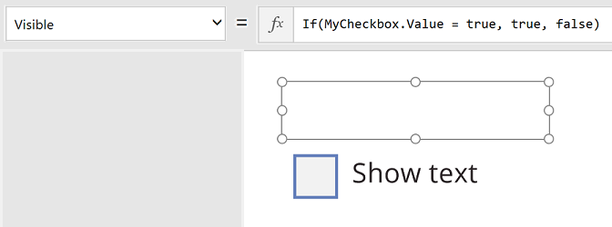

8. Klik of tik op het besturingselement **Selectievakje** om het selectiekader eraan toe te voegen, en klik of tik er vervolgens nogmaals op om een vinkje toe te voegen.

    Het **label** wordt opnieuw weergegeven:

    

9. Schakel het besturingselement **Selectievakje** uit om het besturingselement **Label** te verbergen.

    

Dit is een eenvoudig voorbeeld, maar u kunt het gedrag en uiterlijk van uw app met behulp van een of [formules](formula-reference.md) variëren van eenvoudig tot complex.

## De naam van een scherm of besturingselement wijzigen
Door de naam een scherm of besturingselement te wijzigen, kunt u formules maken die makkelijker zijn te lezen en te onderhouden.

1. Klik of tik op het scherm of het besturingselement waarvan u de naam wilt wijzigen.

2. Klik of tik in het rechterdeelvenster op de naam van de eigenschap (boven het tabblad **Eigenschappen**) en typ vervolgens de naam die u wilt gebruiken.

    

## Een scherm of een besturingselement zoeken en selecteren
U kunt een scherm of besturingselement vinden en selecteren, zelfs als dit is verborgen of onder een ander besturingselement valt. Dit doet u door ernaar te zoeken in het linkerdeelvenster. In dit deelvenster ziet u ofwel een miniatuur van elk scherm in de app, ofwel een hiërarchische weergave van elk scherm en de besturingselementen die het bevat.

* **Als u wilt schakelen tussen de miniaturen en de hiërarchische weergave**, klikt of tikt u op een pictogram in de rechterbovenhoek van het deelvenster.

    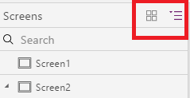

* **Als u een besturingselement wilt zoeken**, typt u één of meer tekens om de namen van besturingselementen te markeren die de tekst die u hebt getypt bevatten.

    Als u op een zoekresultaat klikt of tikt, selecteert u dit besturingselement in de app.

    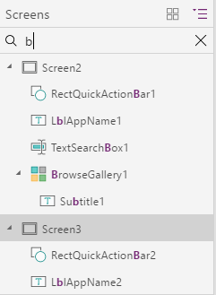

* **Als u een scherm omhoog of omlaag wilt verplaatsen, dupliceren, verwijderen of de naam ervan wilt wijzigen**, klikt u erop met de rechtermuisknop (of klik of tik op het weglatingsteken ernaast). Klik of tik vervolgens op de gewenste optie.

    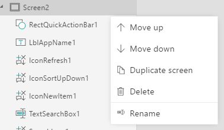

* **Als u een scherm wilt kopiëren/plakken, verwijderen of de naam ervan wilt wijzigen**, klikt u erop met de rechtermuisknop (of klik of tik op het weglatingsteken ernaast). Klik of tik vervolgens op de gewenste optie.
