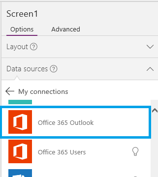
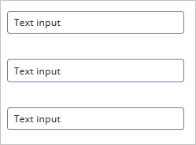

# Verbinding maken met Office 365 Outlook vanuit PowerApps

Als u verbinding maakt met Office 365 Outlook, kunt u, naast andere taken, e-mailberichten weergeven, verzenden, verwijderen en beantwoorden.

U kunt besturingselementen toevoegen om deze functies in uw app uit te voeren. U kunt bijvoorbeeld besturingselementen **Text input** toevoegen om te vragen naar de ontvanger, het onderwerp en de hoofdtekst van het e-mailbericht, en een besturingselement **Button** toevoegen om de e-mail te verzenden.

In dit onderwerp wordt beschreven hoe u Office 365 Outlook als verbinding kunt toevoegen, Office 365 Outlook als gegevensbron aan uw app kunt toevoegen en deze gegevens in verschillende besturingselementen kunt gebruiken.

> [!IMPORTANT]
> Ten tijde van dit schrijven ondersteunt de agendabewerking geen terugkerende gebeurtenissen.

[!INCLUDE [connection-requirements](../../../includes/connection-requirements.md)]

## Verbinding maken met Office 365 Outlook
1. [Voeg een gegevensverbinding toe](../add-data-connection.md) en selecteer **Office 365 Outlook**:  
   
    
2. Selecteer **Connect** en als u wordt gevraagd om aan te melden, voert u uw werkaccount in.

De verbinding met Office 365 Outlook is gemaakt en aan uw app toegevoegd. U kunt de verbinding nu gebruiken.

## Berichten weergeven
1. Selecteer in het menu **Invoegen** de optie **Galerie** en selecteer vervolgens het besturingselement **Tekstgalerie**.
2. Stel de eigenschap **[Items](../controls/properties-core.md)** in op de volgende formule:  
   
    `Office365.GetEmails({fetchOnlyUnread:false})`
   
    Het besturingselement voor de galerie wordt automatisch gevuld met een aantal e-mails.
3. Stel in de galerie de eigenschap **Text** van het eerste label in op `ThisItem.From`. Stel het tweede label in op `ThisItem.Subject`. Stel het derde label in op `ThisItem.Body`. U kunt ook de grootte van de labels aanpassen.
   
    Het besturingselement voor de galerie wordt automatisch gevuld met de nieuwe eigenschappen.
4. Voor deze functie is een aantal optionele parameters beschikbaar. Stel de eigenschap **Items** van de galerie in op een van de volgende formules:
   
    `Office365.GetEmails({fetchOnlyUnread:false})`  
    `Office365.GetEmails({fetchOnlyUnread:false, top:2})`  
    `Office365.GetEmails({folderPath:"Sent Items", fetchOnlyUnread:false, top:2})`  
    `Office365.GetEmails({folderPath:"Sent Items", fetchOnlyUnread:false, top:2, searchQuery:"powerapps"})`  
    `Office365.GetEmails({folderPath:"Deleted Items", fetchOnlyUnread:false, top:2, skip:3})`

## Een bericht verzenden
1. Selecteer **Text** in het menu **Insert** en selecteer vervolgens **Text input**.
2. Herhaal de vorige stap nog twee keer zodat u drie vakken hebt, en rangschik ze vervolgens in een kolom:  
   
    
3. Wijzig de naam van de besturingselementen in:  
   
   * **inputTo**
   * **inputSubject**
   * **inputBody**
4. Selecteer in het menu **Invoegen** de optie **Besturingselementen** en selecteer vervolgens **Knop**. Stel de eigenschap **[OnSelect](../controls/properties-core.md)** in op de volgende formule:  
   
    `Office365.SendEmail(inputTo.Text, inputSubject.Text, inputBody.Text)`
5. Verplaats de knop, zodat deze onder de overige besturingselementen wordt weergegeven en stel de eigenschap **[Tekst](../controls/properties-core.md)** in op **E-mail verzenden**.
6. Druk op F5 of selecteer de knop Voorbeeld (). Typ een geldig e-mailadres in **inputTo** en typ de door u gewenste tekst in de andere twee besturingselementen voor **Tekstinvoer**.
7. Selecteer **E-mail verzenden** om de e-mail te verzenden. Druk op Esc om terug te gaan naar de standaardwerkruimte.

## Een bericht met een bijlage verzenden
U kunt bijvoorbeeld een app maken waarin de gebruiker foto’s neemt met de camera van het apparaat en die vervolgens als bijlagen verzendt. Gebruikers kunnen ook vele andere soorten bestanden toevoegen als bijlage in de e-mail-app.

Volg de stappen in de vorige sectie om een bijlage toe te voegen aan een bericht, maar voeg een parameter toe voor het opgeven van een bijlage (wanneer u de eigenschap **OnSelect** van de knop instelt). Deze parameter is gestructureerd als een tabel, waarin u maximaal drie eigenschappen opgeeft voor elke bijlage:

* Naam
* ContentBytes
* @odata.type

> [!NOTE]
> U kunt de eigenschap @odata.type voor slechts één bijlage opgeven en instellen op een lege tekenreeks.

In dit voorbeeld wordt een foto verzonden als **file1.jpg**:

`Office365.SendEmail(inputTo.Text, inputSubject.Text, inputBody.Text, {Attachments:Table({Name:"file1.jpg", ContentBytes:Camera1.Photo, '@odata.type':""})})`

In dit voorbeeld wordt naast de foto ook een audiobestand verzonden:

`Office365.SendEmail(inputTo.Text, inputSubject.Text, inputBody.Text, {Attachments:Table({Name:"file1.jpg", ContentBytes:Camera1.Photo, '@odata.type':""}, {Name:"AudioFile", ContentBytes:microphone1.audio })})`

## Een bericht verwijderen
1. Selecteer in het menu **Invoegen** de optie **Galerie** en selecteer vervolgens het besturingselement **Tekstgalerie**.
2. Stel de eigenschap **[Items](../controls/properties-core.md)** in op de volgende formule:  
   
    `Office365.GetEmails({fetchOnlyUnread:false})`
   
    Het besturingselement voor de galerie wordt automatisch gevuld met een aantal e-mails.
3. Stel in de galerie de eigenschap **Text** van het eerste label in op `ThisItem.Id`. Stel het tweede label in op `ThisItem.Subject`. Stel het derde label in op `ThisItem.Body`.
4. Selecteer het eerste label in de galerie en wijzig de naam ervan in **EmailID**:
   
    
5. Selecteer het derde label in de galerie en voeg een **knop** toe (menu **Invoegen**). Stel de eigenschap **OnSelect** van de knop in op de volgende formule:  
   
    `Office365.DeleteEmail(EmailID.Text)`
6. Druk op F5 of selecteer de knop Voorbeeld (). Selecteer een van de e-mails in de galerie en klik op de knop. 
    
    > [!NOTE]
    > Hiermee wordt de geselecteerde e-mail uit uw Postvak IN verwijderd. Let dus goed op wat u selecteert.
7. Druk op Esc om terug te gaan naar de standaardwerkruimte.

## Een bericht markeren als gelezen
In deze sectie wordt gebruikgemaakt van dezelfde besturingselementen als in [Bericht verwijderen](connection-office365-outlook.md#delete-a-message).

1. Stel de eigenschap **OnSelect** van de knop in op de volgende formule:  
   
    `Office365.MarkAsRead(EmailID.Text)`
2. Druk op F5 of selecteer de knop Voorbeeld (). Selecteer een van de ongelezen e-mails en klik op de knop.
3. Druk op Esc om terug te gaan naar de standaardwerkruimte.

## Nuttige koppelingen
* Zie [Referentie voor Office 365 Outlook](https://docs.microsoft.com/connectors/office365connector/) voor een lijst met alle functies en de bijbehorende parameters.
* Bekijk alle [beschikbare verbindingen](../connections-list.md).  
* Informatie over [het beheren van uw verbindingen](../add-manage-connections.md).

