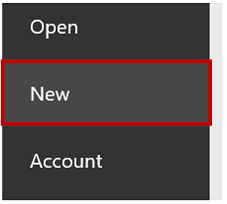
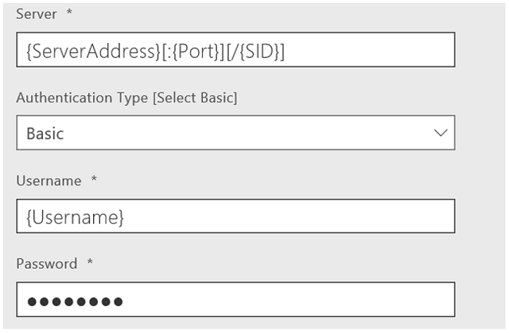
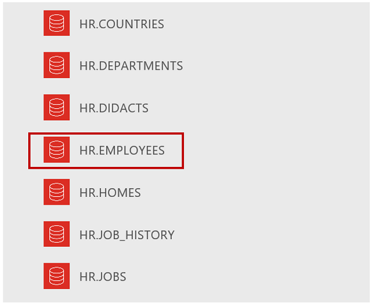

# Verbinding maken met een Oracle-database vanuit PowerApps
U kunt tabellen weergeven en tabelrijen maken, lezen, bijwerken en verwijderen in een Oracle-database nadat u een verbinding en een app hebt gemaakt in PowerApps. De Oracle Database-verbinding ondersteunt volledige delegering voor filteren, sorteren en andere functies, maar geen triggers of opgeslagen procedures.

## Vereisten
* Oracle 9 en hoger
* Oracle-clientsoftware 8.1.7 en hoger
* Installatie van een on-premises gegevensgateway
* Installatie van de Oracle-client-SDK

### Een on-premises gegevensgateway installeren
Volg de stappen [in deze zelfstudie](../gateway-management.md) om een gateway te installeren.

Een on-premises gegevensgateway fungeert als een brug waarmee u over snelle en veilige gegevensoverdracht beschikt tussen on-premises gegevens (gegevens die zich niet in de cloud bevinden) en de services van Power BI, Microsoft Flow, Logic Apps en PowerApps. U kunt dezelfde gateway gebruiken met meerdere services en meerdere gegevensbronnen. Zie [Over gateways](../gateway-reference.md) voor meer informatie.

### Oracle-client installeren
Installeer de [64-bits ODAC 12c versie 4 (12.1.0.2.4) voor Windows x64](http://www.oracle.com/technetwork/database/windows/downloads/index-090165.html) op dezelfde computer als de on-premises gegevensgateway. Anders wordt er een fout weergegeven tijdens het maken of gebruiken van de verbinding, zoals wordt beschreven in de lijst met bekende problemen.

## Een app maken vanuit een tabel in een Oracle-database
1. Klik of tik in PowerApps Studio op **Nieuw** in het menu **Bestand** (aan de linkerkant).
   
   
2. Klik of tik onder **Beginnen met uw gegevens** op de pijl.
   
      Er wordt een lijst met bestaande verbindingen weergegeven.
3. Klik of tik op **Nieuwe verbinding**.
   
   
4. Klik of tik in de lijst met verbindingen op **Oracle Database**.
   
   
5. Geef de naam van een Oracle-server, een gebruikersnaam en een wachtwoord op.
   
    Geef een server in de volgende notatie op als er een SID is vereist: 
    *Servernaam*/*SID*
   
   
6. Klik of tik op de gateway die u wilt gebruiken of installeer een gateway.
   
    Als de gateway niet wordt weergegeven nadat u deze hebt geïnstalleerd, klikt u op **Gatewaylijst vernieuwen**.
   
   
7. Klik of tik op **Maken** om de verbinding te maken.
   
   
8. Klik of tik op de **standaard**gegevensset.
   
   
9. Klik of tik in de lijst met tabellen op de tabel die u wilt gebruiken.
   
   
10. Klik op **Verbinden** om de app te maken.
    
    

In PowerApps wordt een app gemaakt met drie schermen waarin gegevens uit de geselecteerde tabel worden weergegeven:

* **BrowseScreen1**, dat alle items in de tabel bevat.
* **DetailScreen1**, waarin meer informatie over één item wordt weergegeven.
* **EditScreen1**, waarin gebruikers een item kunnen bijwerken of maken.

## Volgende stappen
* Druk op Ctrl+S om de zojuist gegenereerde app op te slaan.
* Zie [Een indeling aanpassen](../customize-layout-sharepoint.md) om **BrowseScreen1** (dat standaard wordt weergegeven) aan te passen.
* Zie [Een formulier aanpassen](../customize-forms-sharepoint.md) om **DetailsScreen1** of **EditScreen1** aan te passen.

## Bekende problemen, tips en probleemoplossing
1. Kan de gateway niet bereiken.
   
    Deze fout treedt op als de on-premises gegevensgateway geen verbinding kan maken met de cloud. Als u de status van uw gateway wilt controleren, meldt u zich aan bij powerapps.microsoft.com, klikt of tikt u op **Gateways** en klikt of tikt u op de gateway die u wilt gebruiken.
   
    Zorg ervoor dat uw gateway actief is en verbinding kan maken met internet. Installeer the gateway niet op een computer die is uitgeschakeld of zich in slaapstand bevindt. Probeer ook de on-premises gegevensgatewayservice (PBIEgwService) opnieuw te starten.
2. Voor System.Data.OracleClient is Oracle-clientsoftware versie 8.1.7 of hoger vereist.
   
    Deze fout treedt op als de Oracle-client-SDK niet is geïnstalleerd op dezelfde computer als de on-premises gegevensgateway. [Installeer de officiële provider](https://go.microsoft.com/fwlink/p/?LinkID=272376) om dit probleem op te lossen.
3. Voor tabel [tabelnaam] zijn geen sleutelkolommen gedefinieerd.
   
    Deze fout treedt op als u verbinding maakt met een tabel die geen primaire sleutel heeft. Deze sleutel is vereist voor de Oracle Database-verbinding.
4. Vanaf nu worden opgeslagen procedures, tabellen met samengestelde sleutels en geneste objecttypen in tabellen niet meer ondersteund.

