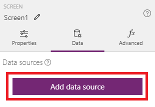
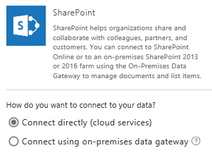
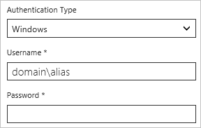

# Verbinding maken met Sharepoint vanuit PowerApps

Maak verbinding met een SharePoint-site om automatisch een app te genereren op basis van een lijst, een volledig nieuwe app te bouwen of een bestaande app bij te werken.

## Bekende problemen
U kunt gegevens uit een aangepaste lijst toevoegen, maar geen bibliotheek. Bovendien worden niet alle typen kolommen ondersteund en ondersteunen niet alle typen kolommen alle typen kaarten.

| Type kolom | Ondersteuning | Standaardkaarten |
| --- | --- | --- |
| Eén tekstregel |Ja |Tekst weergeven |
| Meerdere tekstregels |Ja |Tekst weergeven |
| Keuze |Ja |Zoekopdracht weergeven Zoekopdracht bewerken Multiselect weergeven Multiselect bewerken |
| Getal |Ja |Percentage weergeven Classificatie weergeven Tekst weergeven |
| Valuta |Ja |Percentage weergeven Classificatie weergeven Tekst weergeven |
| Datum en tijd |Ja |Tekst weergeven |
| Opzoeken |Ja |Zoekopdracht weergeven Zoekopdracht bewerken Multiselect weergeven Multiselect bewerken |
| Boolean (Ja/Nee) |Ja |Tekst weergeven Wisselknop weergeven |
| Persoon of groep |Ja |Zoekopdracht weergeven Zoekopdracht bewerken Multiselect weergeven Multiselect bewerken |
| Hyperlink |Ja |URL weergeven Tekst weergeven |
| Afbeelding |Ja (alleen-lezen) |Afbeelding weergeven Tekst weergeven |
| Bijlage |Ja (alleen-lezen) |Bijlagen weergeven|
| Berekend |Ja (alleen-lezen) | |
| Taakresultaat |Nee | |
| Externe gegevens |Nee | |
| Beheerde metagegevens |Ja (alleen-lezen) | |
| Waardering |Nee | |

Kolommen die spaties bevatten, kunnen door PowerApps worden gelezen. De spaties worden echter wel vervangen door de hexadecimale escape-code **'\_x0020\_'**. **'Naam kolom'** wordt in SharePoint bijvoorbeeld weergegeven als **'Naam_x0020_kolom'** in de gegevensindeling of in een formule in PowerApps.

## Vereisten
1. [Meld u aan](../../signup-for-powerapps.md) voor PowerApps.

1. [Meld u aan](http://web.powerapps.com) bij PowerApps door dezelfde referenties in te voeren die u hebt gebruikt om u te registreren.

1. Selecteer aan de linkerkant **Apps** en selecteer vervolgens **Een app maken** in de banner.

## Een app maken
* [Genereer automatisch een app](../app-from-sharepoint.md) op basis van gegevens in een SharePoint-lijst.

    De app heeft standaard drie schermen: een om in records te bladeren, een om details van één record weer te geven en een om record te maken of bij te werken. Nadat de app is gegenereerd, wilt u waarschijnlijk [het bladerscherm](../customize-layout-sharepoint.md) en [de schermen voor details en bewerken](../customize-forms-sharepoint.md) aan uw wensen aanpassen.

    **Opmerking**: als de SharePoint-lijst een kolom van het type **Keuze**, **Opzoeken** of **Persoon of groep** bevat, raadpleegt u [Gegevens in een galerie weergeven](connection-sharepoint-online.md#show-data-in-a-gallery) verderop in dit onderwerp.

* Bouw uw eigen app door [verbinding te maken met SharePoint](../connect-to-sharepoint.md), de concepten in [Een volledig nieuwe app maken](../get-started-create-from-blank.md) te lezen en deze toe te passen op SharePoint in plaats van Excel.

## Een SharePoint-lijst toevoegen aan een bestaande app
1. Open in PowerApps Studio de app die u wilt bijwerken.

2. Klik of tik op het lint, op het tabblad **Weergeven**, op **Gegevensbronnen**

3. Klik of tik in het rechterdeelvenster op **Gegevensbron toevoegen**.

    

4. Klik of tik op **Nieuwe verbinding**, klik of tik op **SharePoint** en klik of tik op **Verbinden**.

    

5. Geef het type SharePoint-site op waarmee u verbinding wilt maken:

    

   * Klik of tik op **Rechtstreekse verbinding maken (cloudservices)** om verbinding te maken met SharePoint Online.

   * Klik of tik op **Verbinding maken via een on-premises gegevensgateway** om verbinding te maken met een on-premises SharePoint-site.

       Geef **Windows** op als verificatietype en geef uw referenties op. (Als uw referenties een domeinnaam bevatten, geef deze dan op als *domein\alias*.)

       

       **Opmerking**: als er geen on-premises gegevensgateway is geïnstalleerd, [installeert u er een](../gateway-reference.md) en klikt of tikt u op het pictogram om de lijst met gateways te vernieuwen.

       Klik of tik onder **Een gateway kiezen** op de gateway die u wilt gebruiken.

       

6. Klik of tik op **Verbinden**.

7. Klik of tik onder **Verbinding maken met een SharePoint-site** op een vermelding in de lijst **Recente sites** (of typ of plak de URL voor de site die u wilt gebruiken) en klik of tik op **Ga**.

    

8. Schakel onder **Een lijst kiezen** het selectievakje in voor een of meer lijsten die u wilt gebruiken en klik of tik op **Verbinden**:  

    

    Niet alle soorten lijsten worden standaard weergegeven. Als de naam van de lijst die u wilt gebruiken niet wordt weergegeven, scrolt u naar beneden en typt u de lijstnaam in het vak **Een aangepaste lijstnaam invoeren**.

    

    De gegevensbronnen worden toegevoegd aan uw app.

    

## Gegevens weergeven in een galerie
Als u gegevens uit een van deze typen kolommen in een galerie wilt weergeven, gebruikt u de formulebalk om de eigenschap **Tekst** van een of meer besturingselementen **Label** in die galerie in te stellen:

* Voor een **keuze**- of **opzoek**kolom geeft u **ThisItem.[Kolomnaam].Value** op om gegevens weer te geven in die kolom.

    Geef bijvoorbeeld **ThisItem.Locatie.Value** op als u een **keuze**kolom hebt met de naam **Locatie** en geef **ThisItem.Postcode.Value** op als u een **opzoek**kolom met de naam **Postcode** hebt.

* Voor een kolom van het type **Persoon of groep** geeft u **ThisItem.[Kolomnaam].DisplayName** op om de weergavenaam van de gebruiker of de groep weer te geven.

    Geef bijvoorbeeld **ThisItem.Manager.DisplayName** op om weergavenamen weer te geven uit een kolom van het type **Persoon of groep** genaamd **Manager**.

    U kunt ook andere informatie over gebruikers weergeven, zoals e-mailadressen of functies. Als u een volledige lijst met opties wilt weergeven, geeft u **ThisItem.[Kolomnaam].** op (inclusief de punt aan het eind).

    **Opmerking**: voor een kolom van het type **CreatedBy** geeft u **ThisItem.Author.DisplayName** op om de weergavenamen weer te geven van gebruikers die items in de lijst hebben gemaakt. Voor een kolom van het type **ModifiedBy** geeft u **ThisItem.Editor.DisplayName** op om de weergavenamen weer te geven van gebruikers die items in de lijst hebben gewijzigd.

* Voor een kolom met **beheerde gegevens** geeft u **ThisItem.[Kolomnaam].Label** op om gegevens in die kolom weer te geven.

    Geef bijvoorbeeld **ThisItem.Talen.Label** op als u een kolom met **beheerde metagegevens** genaamd **Talen** hebt.

## Volgende stappen
* Lees hoe u [gegevens uit een gegevensbron weergeeft](../add-gallery.md).
* Lees hoe u [gegevens weergeeft en records maakt of bijwerkt](../add-form.md).
* Bekijk andere soorten [gegevensbronnen](../connections-list.md) waarmee u verbinding kunt maken.
