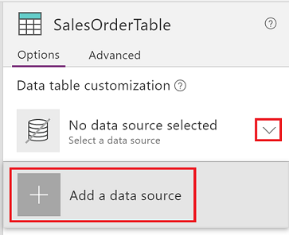
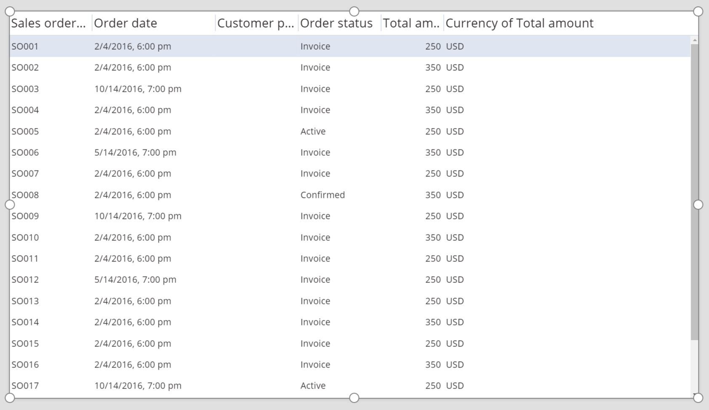
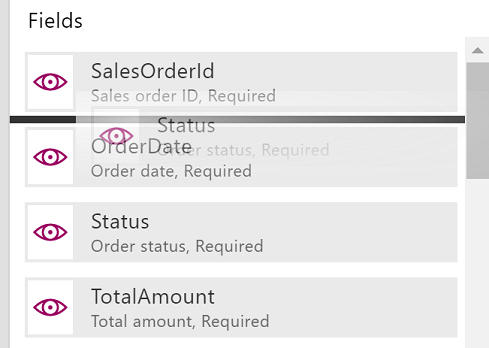
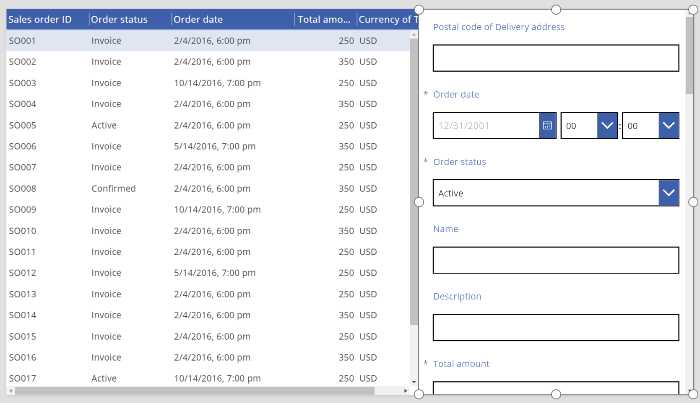

# Besturingselement Gegevenstabel in PowerApps
Gegevens weergegeven in tabelvorm.

## Beschrijving
Het besturingselement **Gegevenstabel** geeft een gegevensset weer in een indeling die kolomkoppen bevat voor elk veld dat in het besturingselement wordt weergegeven. Als een maker van apps, hebt u volledige controle over welke velden worden weergegeven en in welke volgorde. Net als het besturingselement **Galerie** heeft het besturingselement **Gegevenstabel** een eigenschap **Selected** die verwijst naar de geselecteerde rij. U kunt het besturingselement **Gegevenstabel** dus koppelen aan andere besturingselementen.

## Functionaliteit
Het besturingselement **Gegevenstabel** is op 5 mei 2017 geïntroduceerd in PowerApps. Deze sectie bevat informatie over mogelijkheden die worden ondersteund en mogelijkheden die niet worden ondersteund.

### Nu verkrijgbaar
* Gegevens in een besturingselement **Gegevenstabel** zijn alleen-lezen.
* Er wordt altijd één rij geselecteerd in een besturingselement **Gegevenstabel**.
* U kunt een besturingselement **Gegevenstabel** koppelen aan een verbonden of lokale gegevensbron.
* U kunt tijdens het uitvoeren van de app de kolombreedte in een besturingselement **Gegevenstabel** aanpassen, maar de wijzigingen worden niet opgeslagen.
* Als u een besturingselement **Gegevenstabel** koppelt aan een connector waarin deze functie is geïmplementeerd, zoals de Common Data Service, wordt er een reeks standaardvelden weergegeven in het besturingselement. U kunt deze en andere velden vervolgens zo nodig weergeven of verbergen.
* Kolombreedte en koptekst aanpassen.
* Hyperlinks weergeven in een besturingselement **Gegevenstabel**.
* Een **Gegevenstabel**-besturingselement kopiëren en plakken.

### Nog niet beschikbaar
* De stijl van afzonderlijke kolommen aanpassen.
* Een besturingselement **Gegevenstabel** toevoegen aan een formulierbesturingselement.
* De hoogte van alle rijen wijzigen.
* Afbeeldingen weergeven in een besturingselement **Gegevenstabel**.
* Velden uit gerelateerde entiteiten weergeven.
* Ingebouwde functionaliteit gebruiken voor het filteren en sorteren van gegevens op kolomkop.
* Een besturingselement **Gegevenstabel** toevoegen aan een besturingselement **Galerie**.
* Gegevens bewerken in een besturingselement **Gegevenstabel**.
* Meerdere rijen selecteren.

### Bekende problemen
* Er verschijnen geen gegevens als u de functie **FirstN** gebruikt in de eigenschap **Items**.

## Belangrijkste eigenschappen
* [**Items**](properties-core.md): de bron van de gegevens die worden weergegeven in het besturingselement **Gegevenstabel**.
* **Geselecteerd**: de geselecteerde rij in het besturingselement **Gegevenstabel**.

## Andere eigenschappen
* [**BorderColor**](properties-color-border.md): de kleur van de rand van het besturingselement **Gegevenstabel**.
* [**BorderStyle**](properties-color-border.md): de stijl van de rand van het besturingselement **Gegevenstabel**. De opties zijn **Effen**, **Streepjes**, **Gestippeld** en **Geen**.
* [**BorderThickness**](properties-color-border.md): de dikte van de rand van het besturingselement **Gegevenstabel**.
* [**Color**](properties-color-border.md): de standaardtekstkleur voor alle gegevensrijen.
* [**Fill**](properties-color-border.md): de standaardachtergrondkleur voor alle gegevensrijen.
* [**Font**](properties-text.md): het standaardlettertype voor alle gegevensrijen.
* [**FontWeight**](properties-text.md): het standaardtekengewicht voor alle gegevensrijen.
* **HeadingColor**: de tekstkleur voor de kolomkoppen.
* **HeadingFill**: de achtergrondkleur voor de kolomkoppen.
* **HeadingFont**: het lettertype voor de kolomkoppen.
* **HeadingFontWeight**: het tekengewicht voor de kolomkoppen.
* **HeadingSize**: de tekengrootte voor de kolomkoppen.
* [**Height**](properties-size-location.md) : de afstand tussen de boven- en onderrand van het besturingselement **Gegevenstabel**.
* [**HoverColor**](properties-color-border.md) – de tekstkleur voor de rij waarnaar de gebruiker wijst met de muis.
* [**HoverFill**](properties-color-border.md) – de achtergrondkleur van de rij waarnaar de gebruiker wijst met de muis.
* **NoDataText**: het bericht dat de gebruiker ziet als er geen records worden weergegeven in het besturingselement **Gegevenstabel**.
* **SelectedColor**: de kleur van de tekst in de geselecteerde rij.
* **SelectedFill**: de achtergrondkleur voor de geselecteerde rij.
* [**Size**](properties-text.md): de standaardtekengrootte voor alle gegevensrijen.
* [**Visible**](properties-core.md): een waarde die bepaalt of het besturingselement **Gegevenstabel** wordt weergegeven of verborgen.
* [**Width**](properties-size-location.md): de afstand tussen de linker- en rechterrand van het besturingselement **Gegevenstabel**.
* [**X**](properties-size-location.md): de afstand tussen de linkerrand van het besturingselement **Gegevenstabel** en de linkerrand van de bovenliggende container (of de linkerrand van het scherm als er geen bovenliggende container is).
* [**Y**](properties-size-location.md): de afstand tussen de bovenrand van het besturingselement **Gegevenstabel** en de bovenrand van de bovenliggende container (of de bovenrand van het scherm als er geen bovenliggende container is).

## Verwante functies
* [**Filter(DataSource, Formula)**](../functions/function-filter-lookup.md)(*DataSource*, *Formula*)
* [**Search(DataSource, SearchString, Column)**](../functions/function-filter-lookup.md)(*DataSource*, *SearchString*, *Column*)

## Voorbeelden
### Basisgebruik
1. Maak een lege tablet-app.
2. Klik of tik op het tabblad **Invoegen** op **Gegevenstabel**.
   
    
   
    Er is een besturingselement **Gegevenstabel** toegevoegd aan het scherm.
3. Geef het besturingselement **Gegevenstabel** de naam **Verkoopordertabel** en wijzig de grootte ervan zodat het hele scherm wordt gebruikt.
4. Klik of tik in het rechterdeelvenster op het pijl-omlaag naast de tekst **Geen gegevensbron geselecteerd** en klik of tik vervolgens op **Een gegevensbron toevoegen**.
   
    
5. Klik of tik in de lijst met verbindingen op de verbinding voor de database Common Data Service.
   
    
6. Klik of tik in de lijst met entiteiten op **Verkooporder** en klikt of tik vervolgens op **Verbinding maken**.
   
    
   
    Het besturingselement **Gegevenstabel** is nu gekoppeld aan de gegevensbron **Verkooporder**. In het besturingselement **Gegevenstabel** worden verschillende standaardvelden weergegeven omdat we een connector gebruiken die deze mogelijkheid ondersteunt.
   
    
7. Schakel in het rechterdeelvenster een of meer selectievakjes in om die velden weer te geven of te verbergen.
   
    Schakel bijvoorbeeld het selectievakje naast **CustomerPurchaseOrderReference** in om dit veld te verbergen.
8. Wijzig de volgorde van velden door deze in het rechterdeelvenster omhoog of omlaag te slepen.
   
    
   
    Het besturingselement **Verkoopordertabel** bevat de velden in de door u opgegeven volgorde.
   
    

### De stijl van de koptekst van het besturingselement Gegevenstabel wijzigen
1. Selecteer het besturingselement **Gegevenstabel** en klik of tik in het rechterdeelvenster op het tabblad **Geavanceerd**.
2. Klik of tik op het veld voor de eigenschap **HeadingFill** en wijzig de waarde in **RGBA(62,96,170,1)**.
3. Klik of tik op het veld voor de eigenschap **HeadingFill** en wijzig de waarde in **White**.
4. Klik of tik op het veld voor de eigenschap **HeadingSize** en wijzig de waarde in **14**.
   
    

### Een besturingselement Gegevenstabel verbinden met een ander besturingselement
1. Voeg een besturingselement **Formulier bewerken** aan het scherm toe.
2. Pas de grootte van de besturingselementen **Gegevenstabel** en **Formulier bewerken** aan, zodat het besturingselement **Gegevenstabel** in het linkerdeel van het scherm wordt weergegeven en het besturingselement **Formulier bewerken** in het rechterdeel.
   
    
3. Selecteer **Form1** en wijzig in het rechterdeelvenster het aantal kolommen in **1**.
4. Verbind **Form1** met de gegevensbron **Verkooporder**.
   
    Er worden verschillende standaardvelden weergegeven in **Form1**.
   
    
5. Klik of tik in het rechterdeelvenster op het tabblad **Geavanceerd**.
6. Stel de eigenschap **Item** voor **Form1** in op **SalesOrderTable.Selected**.
   
    **Form1** bevat gegevens uit de rij die is geselecteerd in het besturingselement **Gegevenstabel**.
   
    

## Richtlijnen voor toegankelijkheid
### Kleurcontrast
Er moet voldoende kleurcontrast zijn tussen:
* [**Color**](properties-color-border.md) en [**Fill**](properties-color-border.md)
* **HeadingColor** en **HeadingFill**
* **SelectedColor** en **SelectedFill**
* [**HoverColor**](properties-color-border.md) en [**HoverFill**](properties-color-border.md)

Dit komt bovenop de [standaardvereisten voor kleurcontrast](../accessible-apps-color.md).

### Ondersteuning voor schermlezers
* **NoDataText** moet aanwezig zijn.
