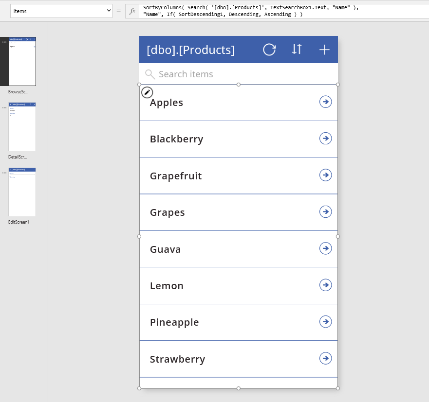
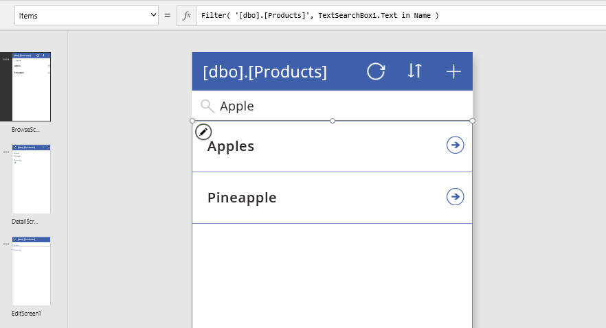
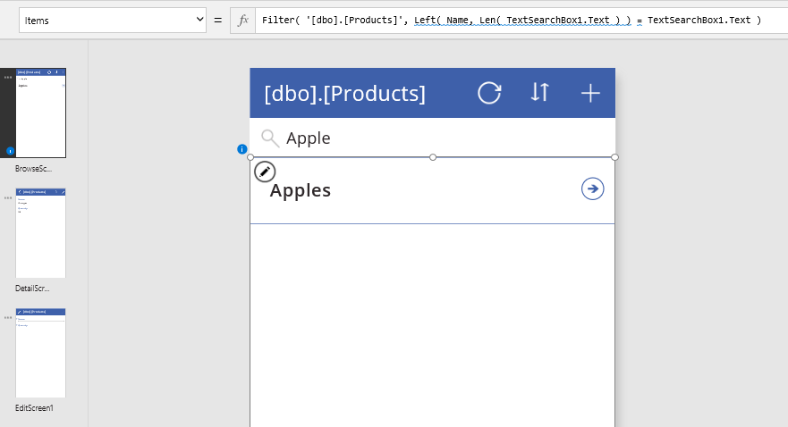

# Delegering
PowerApps bevat een krachtige set functies voor het filteren, sorteren en structureren van gegevenstabellen: **[Filter](functions/function-filter-lookup.md)**, **[Sort](functions/function-sort.md)** en **[AddColumns](functions/function-table-shaping.md)** om er maar een paar te noemen.  Met behulp van deze functies kunt u uw gebruikers gerichte toegang bieden tot de informatie die zij nodig hebben.  Voor lezers met een databaseachtergrond is het gebruiken van deze functies vergelijkbare met het schrijven van een databasequery.  

De sleutel voor het maken van efficiënte apps is om de hoeveelheid gegevens te minimaliseren die moet worden overgebracht naar een apparaat.  Misschien zijn er slechts enkele records uit de totale hoeveelheid van miljoenen records nodig of kan één cumulatieve waarde duizenden records vertegenwoordigen.  Het kan ook voldoende zijn om alleen de eerste set records op te halen en de rest pas als de gebruiker daar om vraagt.  Een goede focus kan betekenen dat uw app aanzienlijk minder verwerkingskracht, geheugen en netwerkbandbreedte nodig heeft. Het resultaat hiervan is dat de responstijden voor uw gebruikers laag zijn, zelfs op telefoons die zijn verbonden via een mobiel netwerk.  

*Delegering* is waar de expressiviteit van PowerApps-formules en de behoefte om zo min mogelijk gegevens via het netwerk te verplaatsen bij elkaar komen.  Kort gezegd betekent het dat PowerApps de verwerking van gegevens delegeert aan de gegevensbron, in plaats van de gegevens voor lokale verwerking naar de app te verplaatsen.  

Waar het ingewikkeld wordt, en wat de bestaansreden is voor dit artikel, is dat niet alles dat kan worden uitgedrukt in een PowerApps-formule aan iedere gegevensbron kan worden gedelegeerd.  De PowerApps-taal imiteert de formuletaal van Excel, die is ontworpen op basis van volledige en directe toegang tot een complete werkmap in het geheugen, met een grote verscheidenheid aan functies voor het manipuleren van numerieke waarden en tekst.  Als gevolg hiervan is de PowerApps-taal veel uitgebreider dan de meeste gegevensbronnen aankunnen, met inbegrip van krachtige database-engines zoals SQL Server.

**Het werken met grote gegevenssets vereist gegevensbronnen en formules die kunnen worden gedelegeerd.**  Dit is de enige manier om ervoor te zorgen dat uw app goed blijft presteren en gebruikers toegang hebben tot alle informatie die zij nodig hebben. Let goed op [blauwe stippen met suggesties](delegation-overview.md#blue-dot-suggestions). Deze stippen geven aan dat delegering op die plaats niet mogelijk is.  Als u werkt met kleine gegevenssets (minder dan 500 records), kunt u elke gegevensbron en formule gebruiken aangezien de verwerking lokaal kan plaatsvinden als de formule niet kan worden gedelegeerd. 

## Delegeerbare gegevensbronnen
Zie dit [overzicht](delegation-list.md) voor een volledige lijst van de gegevensbronnen die delegering ondersteunen en in welke mate.

Het is wel zo dat er regelmatig ondersteuning voor delegering wordt toegevoegd aan bestaande gegevensbronnen, plus dat er steeds meer gegevensbronnen bijkomen.

Er is geen delegering nodig voor geïmporteerde Excel-werkmappen (via de gegevensbron 'Statische gegevens toevoegen aan uw app'), verzamelingen en tabellen die zijn opgeslagen in contextvariabelen. Al deze gegevens zijn al aanwezig in het geheugen en de PowerApps-taal kan maximaal worden toegepast.

## Delegeerbare functies
De volgende stap is om alleen de formules te gebruiken die kunnen worden gedelegeerd. Hier worden alle formule-elementen beschreven die kunnen worden gedelegeerd.  Elke gegevensbron is echter anders en niet alle gegevensbronnen ondersteunen al deze elementen. Kijk of er in een bepaalde formule blauwe stippen met suggesties staan.

Deze lijsten worden trouwens regelmatig bijgewerkt. We zijn bezig om voor meer functies en operatoren ondersteuning voor delegering aan te bieden.

### Filterfuncties
**[Filter](functions/function-filter-lookup.md)**, **[Search](functions/function-filter-lookup.md)** en **[LookUp](functions/function-filter-lookup.md)** kunnen worden gedelegeerd.  

Binnen de functies **Filter** en **LookUp** kunnen de volgende elementen worden gebruikt met kolommen van de tabel om de juiste records te selecteren:

* **[And](functions/function-logicals.md)** (inclusief **[&&](functions/operators.md)**), **[Or](functions/function-logicals.md)** (inclusief **[||](functions/operators.md)**), **[Not](functions/function-logicals.md)** (inclusief **[!](functions/operators.md)**)
* **[In](functions/operators.md)**
* **[=](functions/operators.md)**, **[<>](functions/operators.md)**, **[>=](functions/operators.md)**, **[<=](functions/operators.md)**, **[>](functions/operators.md)**, **[<](functions/operators.md)**
* **[+](functions/operators.md)**, **[-](functions/operators.md)**
* **[TrimEnds](functions/function-trim.md)**
* **[IsBlank](functions/function-isblank-isempty.md)**
* **[StartsWith](functions/function-startswith.md)**
* Constante waarden die hetzelfde zijn voor alle records, zoals de eigenschappen van besturingselementen en [globale en contextvariabelen](working-with-variables.md).

Elementen van een formule die voor alle records een constante waarde opleveren, kunnen ook worden gebruikt.  **Left (Language(), 2)** is bijvoorbeeld niet afhankelijk van een kolom van de record en retourneert dus voor alle records dezelfde waarde.  Het is in feite een constante.  Het gebruik van contextvariabelen, verzamelingen en signalen is mogelijk niet constant en daarom kunnen **Filter** en **LookUp** niet worden gedelegeerd.  

Er ontbreken enkele belangrijke items in de bovenstaande lijst:

* **[If](functions/function-if.md)**
* **[*](functions/operators.md)**, **[/](functions/operators.md)**, **[Mod](functions/function-mod.md)**
* **[Concatenate](functions/function-concatenate.md)** (inclusief **[&](functions/operators.md)**)
* **[ExactIn](functions/operators.md)**
* Functies voor tekenreeksmanipulatie: **[Lower](functions/function-lower-upper-proper.md)**, **[Upper](functions/function-lower-upper-proper.md)**, **[Left](functions/function-left-mid-right.md)**, **[Mid](functions/function-left-mid-right.md)**, **[Len](functions/function-left-mid-right.md)**, ...
* Signalen: **[Location](functions/signals.md)**, **[Acceleration](functions/signals.md)**, **[Compass](functions/signals.md)**, ...
* Vluchtige functies: **[Now](functions/function-now-today-istoday.md)**, **[Today](functions/function-now-today-istoday.md)**, **[Rand](functions/function-rand.md)**, ...
* [Verzamelingen](working-with-variables.md)

### Sorteerfuncties
**[Sort](functions/function-sort.md)** en **[SortByColumns](functions/function-sort.md)** kunnen worden gedelegeerd.  

Bij **Sort** kan de formule alleen bestaan uit de naam van één kolom. Bovendien kan de formule geen andere operatoren of functies bevatten.

### Statistische functies
**[Sum](functions/function-aggregates.md)**, **[Average](functions/function-aggregates.md)**, **[Min](functions/function-aggregates.md)** en **[Max](functions/function-aggregates.md)** kunnen worden gedelegeerd.  Op dit moment wordt deze delegering maar door een beperkt aantal gegevensbronnen ondersteund. Bekijk de [delegeringslijst](delegation-list.md) voor meer informatie.

Optelfuncties, zoals **[CountRows](functions/function-table-counts.md)**, **[CountA](functions/function-table-counts.md)** en **[Count](functions/function-table-counts.md)**, kunnen niet worden gedelegeerd.

Andere statistische functies, zoals **[StdevP](functions/function-aggregates.md)** en **[VarP ](functions/function-aggregates.md)**, kunnen niet worden gedelegeerd.

## Niet-delegeerbare functies
Alle andere functies bieden geen ondersteuning voor delegeringen, waaronder deze belangrijke functies:

* Tabel aanpassen: **[AddColumns](functions/function-table-shaping.md)**, **[DropColumns](functions/function-table-shaping.md)**, **[ShowColumns](functions/function-table-shaping.md)**, ...
* **[First](functions/function-first-last.md)**, **[FirstN](functions/function-first-last.md)**, **[Last](functions/function-first-last.md)**, **[LastN](functions/function-first-last.md)**
* **[Concat](functions/function-concatenate.md)**
* **[Collect](functions/function-clear-collect-clearcollect.md)**, **[ClearCollect](functions/function-clear-collect-clearcollect.md)**
* **[CountIf](functions/function-table-counts.md)**, **[RemoveIf](functions/function-remove-removeif.md)**, **[UpdateIf](functions/function-update-updateif.md)**
* **[GroupBy](functions/function-groupby.md)**, **[Ungroup](functions/function-groupby.md)**

Een veelgebruikte methode is om **AddColumns** en **LookUp** te gebruiken om gegevens uit de ene tabel samen te voegen in een andere tabel, iets wat in databasejargon een 'join' wordt genoemd.  Bijvoorbeeld:

**AddColumns( Producten, "Naam leverancier", LookUp( Leveranciers, Suppliers.ID = Product.SupplierID ).Name )**

Hoewel **Producten** en **Leveranciers** delegeerbare gegevensbronnen kunnen zijn en **LookUp** een delegeerbare functie is, geldt dat niet voor de functie **AddColumns**.  Het resultaat van de gehele formule wordt dan ook beperkt tot het eerste deel van de gegevensbron **Producten**.  

Aangezien **LookUp** en de bijbehorende gegevensbron delegeerbaar zijn, kan er overal in de gegevensbron een overeenkomst worden gevonden voor **Leveranciers**, zelfs als het een grote gegevensbron is.  Een mogelijk nadeel is dat **LookUp** voor elk van de eerste records in **Producten** afzonderlijke aanroepen naar de gegevensbron gebruikt, waardoor er nogal wat 'chatter' op het netwerk wordt veroorzaakt.  Als de gegevensbron **Leveranciers** niet zo groot is en niet regelmatig verandert, zou u de gegevensbron bij het starten van de app met een aanroep van **Collect** kunnen cachen in de app. U gebruikt hiervoor [**OnVisible**](controls/control-screen.md) op het openingsscherm en voert dan **LookUp** uit op de gegevensbron in de cache.  

## Limiet voor delegering
Formules die kunnen niet worden gedelegeerd, worden lokaal verwerkt.  Op deze manier is het mogelijk om alle functionaliteit van de formuletaal van PowerApps te benutten.  Hier zit echter wel een nadeel aan, namelijk dat alle gegevens eerst moeten worden overgebracht naar het apparaat. Dit kan betekenen dat er een grote hoeveelheid gegevens via het netwerk moet worden opgehaald.  Dat kan even duren, waardoor het kan lijken dat uw app traag is of misschien zelfs is vastgelopen.

Om dit te voorkomen, is er in PowerApps standaard een limiet ingesteld voor de hoeveelheid gegevens die lokaal kan worden verwerkt: 500 records.  We hebben dit aantal gekozen omdat u dan nog steeds volledige toegang hebt tot kleine gegevenssets, terwijl u het gebruik van grote gegevenssets kunt verfijnen door deelresultaten weer te geven.

Uiteraard moet hier voorzichtig mee om worden gegaan omdat het verwarrend kan zijn voor gebruikers.  Laten we als voorbeeld de functie **Filter** nemen met een selectieformule die niet kan worden gedelegeerd, met een gegevensbron met een miljoen records.  Aangezien het filter lokaal moet worden toegepast, worden alleen de eerste 500 records van het miljoen records gescand.  Als de gewenste record 501 is, of 500.001, wordt de record niet geretourneerd door **Filter**.

De ingestelde limiet kan ook verwarrend zijn als het gaat om statistische functies.  Stel dat **Average** wordt toegepast op een kolom uit diezelfde gegevensbron met een miljoen records.  Aangezien **Average** nog niet kan worden gedelegeerd, wordt alleen het gemiddelde van de eerste 500 records geretourneerd.  Voorzichtigheid is dus geboden omdat anders een deelresultaat onterecht als een volledig resultaat wordt geïnterpreteerd door een gebruiker van uw app.

## De limiet wijzigen

500 is het standaardaantal records.  Dit aantal kan worden gewijzigd. Ga daarvoor naar het tabblad Bestand, selecteer App-instellingen in het navigatiedeelvenster links en ga naar Experimentele functies.  Hier vindt u de instelling Gegevensrijlimiet voor niet-delegeerbare query's. De waarde hiervan kan variëren van 1 tot 2000.  Deze instelling geldt voor de gehele app.

In sommige gevallen weet u dat 2000 (of 1000 of 1500) voldoende is voor uw scenario.  U kunt dit aantal vergroten voor uw scenario. Doe dit wel altijd zorgvuldig.  Als u dit aantal namelijk vergroot, kunnen de prestaties van de app verslechteren, vooral bij brede tabellen met veel kolommen.  Het beste blijft om zo veel mogelijk te delegeren.

Als u er zeker van wilt zijn dat uw app naar grote gegevenssets kan schalen, stelt u de instelling in op 1.  Voor alles wat niet kan worden gedelegeerd, wordt één record geretourneerd. Dit maakt detectie tijdens het testen van uw app eenvoudig.  Op die manier komt u niet voor verrassingen te staan wanneer u een concept-app in productie wilt nemen.

## Blauwe stippen met suggesties
Om duidelijk te maken wat wel en wat niet kan worden gedelegeerd, worden in de interface blauwe stippen met suggesties weergegeven wanneer een formule een element bevat dat niet kan worden gedelegeerd.

Blauwe stippen worden alleen weergegeven in formules die worden toegepast op delegeerbare gegevensbronnen.  Als u geen blauwe stip ziet en u denkt dat de formule niet correct wordt gedelegeerd, controleert u het type van de gegevensbron in de lijst met <a href="#delegable-data-sources">delegeerbare gegevensbronnen</a> hierboven.

## Voorbeelden
In dit voorbeeld gebruiken we een SQL Server-tabel met producten, met name fruit, met de naam **[dbo].[Products]**.  In het scherm Nieuw kunt u met PowerApps een eenvoudige app met drie schermen maken die is verbonden met deze gegevensbron:

Kijk eens goed naar de formule voor de eigenschap **Items** van de galerie.  Hierin worden de functies **SortByColumns** en **Search** gebruikt, die beide kunnen worden gedelegeerd.

We typen **'Apple'** in het besturingselement voor het invoeren van zoektekst.  Als u heel goed oplet, ziet u boven aan het scherm bewegende stippen terwijl het nieuwe item in de nieuwe zoekopdracht wordt verwerkt.  De stippen geven aan dat er communicatie is met SQL Server:

Aangezien alles hier delegeerbaar is, zelfs als de tabel **[dbo].[Products]** miljoenen records bevat, worden alle overeenkomende records gevonden en worden er pagina's uit de galerie weergegeven terwijl de gebruiker door de resultaten bladert.

U ziet dat er overeenkomsten zijn gevonden voor zowel 'Apple' als 'Pineapple'.  U kunt de functie **Search** gebruiken om een zoekterm overal in een tekstkolom te vinden.  Het is ook mogelijk om een zoekterm alleen te vinden als die aan het begin van de naam van de vrucht staat.  We gebruiken dan een andere delegeerbare functie, **Filter**, met een complexere zoekterm (voor het overzicht hebben we de aanroep naar **SortByColumns** weggelaten):

Dit lijkt te werken, want nu wordt alleen **'Apples'** weergegeven en **'Pineapple'** niet meer.  Er wordt nu echter een blauwe stip weergegeven naast de galerie en een blauwe golflijn onder een gedeelte van de formule.  De blauwe stip wordt zelfs weergegeven in de miniatuur van het scherm.  Als we de blauwe stip naast de galerie aanwijzen, zien we het volgende:

Hoewel we een delegeerbare functie, **Filter**, gebruiken met een delegeerbare gegevensbron, SQL Server, is de formule die we hebben gebruikt in **Filter** niet delegeerbaar.  **Mid** en **Len** kunnen namelijk aan geen enkele gegevensbron worden gedelegeerd.

Maar het heeft wel gewerkt, toch?  In zekere zin wel.  En om die reden zien we een blauwe stip en niet een geel gevaarpictogram en een rode golflijn om een fout aan te geven.  Als de tabel **[dbo].[Products]** minder dan 500 records bevat, dan heeft de formule perfect gewerkt.   Alle records zijn dan overgebracht naar het apparaat en de functie **Filter** is lokaal toegepast.  

Als de tabel echter meer dan 500 records bevat, worden in de galerie alleen vruchten weergegeven waarvan de naam begint met **'Apple'** *uit de eerste 500 records van de tabel*.  Als **'Apple, Fuji'** wordt weergegeven als een naam in record 501 of 500.001, wordt deze overeenkomst niet gevonden.
