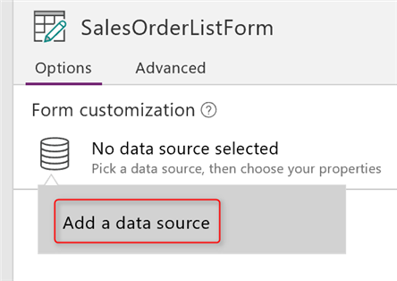
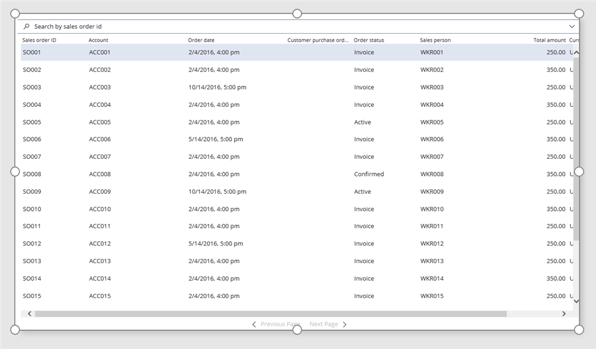
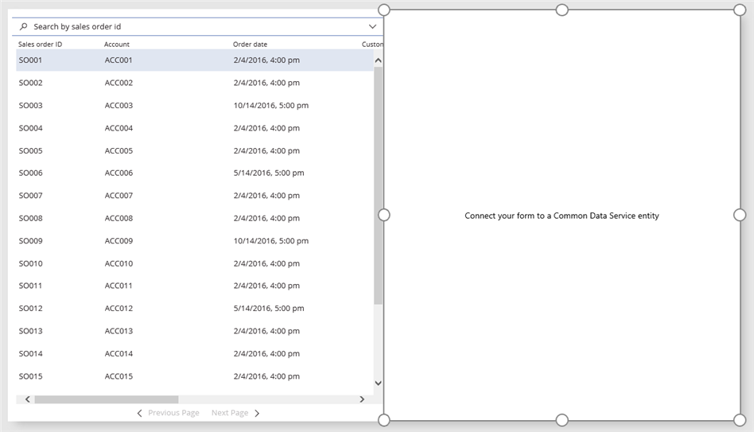
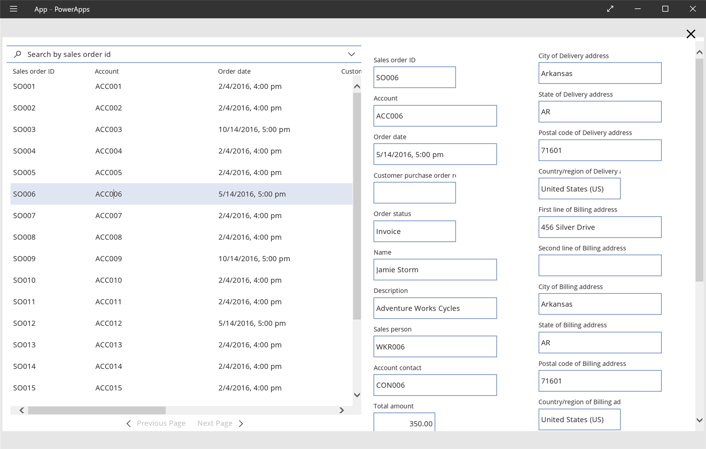
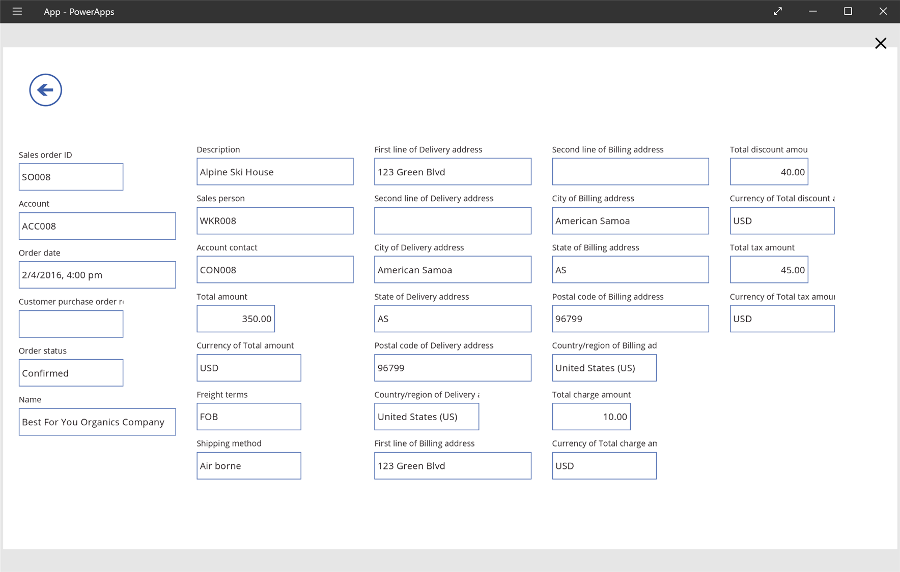
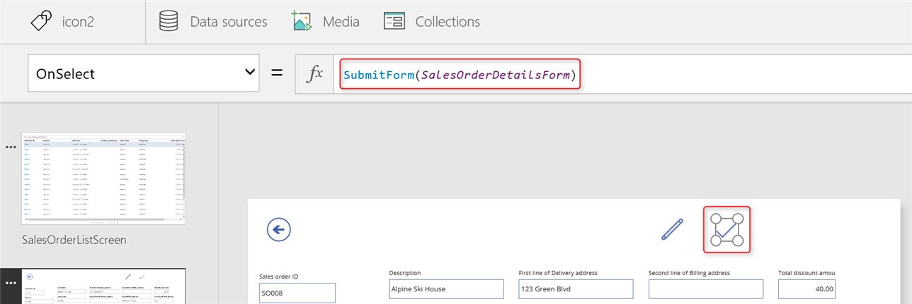
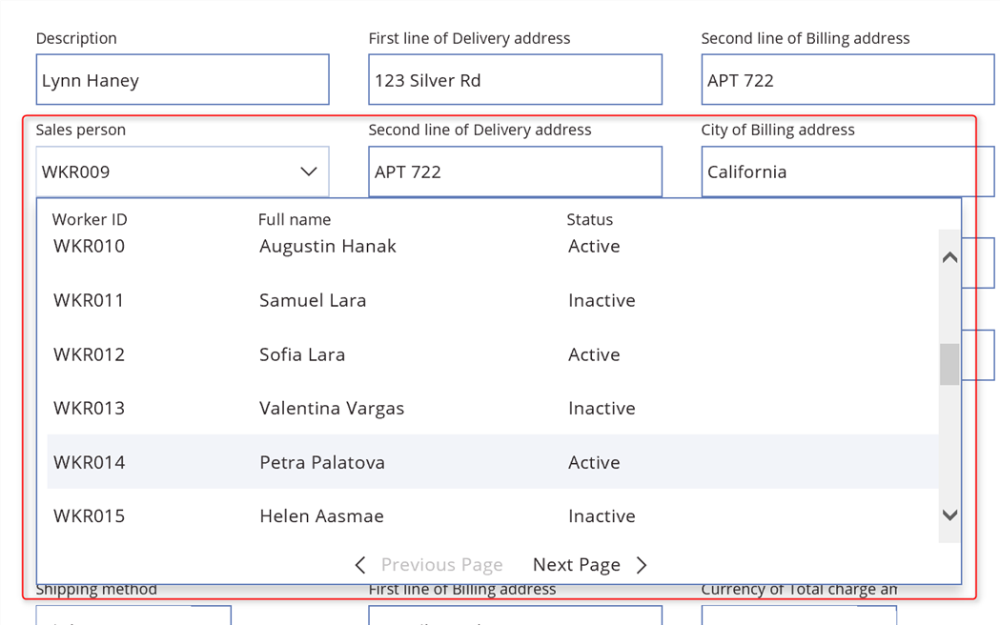

# Besturingselement Formulier voor entiteit gebruiken
Maak sneller apps met het besturingselement **Formulier voor entiteit** om formulieren met opmaak toe te voegen voor een Common Data Service-entiteit.

Zie het blogbericht [Nieuw besturingselement Formulier voor entiteit (experimentele functie) voor Common Data Service](https://powerapps.microsoft.com/blog/new-entity-form-control-experimental-feature-for-common-data-service/) voor een inleiding tot het besturingselement **Formulier voor entiteit**.

> [!IMPORTANT]
> Zoals uiteengezet in het blogbericht bevindt het besturingselement **Formulier voor entiteit** zich nog in de experimentele fase. Wees voorlopig voorzichtig met het gebruiken het besturingselement **Formulier voor entiteit** in productie-apps.

## Belangrijkste eigenschappen
Dit zijn de belangrijkste eigenschappen van een besturingselement **Formulier voor entiteit**.

**Gegevensbron**: de gegevensbron die de record(s) bevat die u wilt weergeven.   
> [!NOTE]
> Momenteel worden alleen entiteiten in de Common Data Service ondersteund als gegevensbronnen voor het besturingselement **Formulier voor entiteit**.  

**Patroon**: de stijl van het formulier dat u wilt weergeven in het besturingselement **Formulier voor entiteit**. Stel deze eigenschap in met behulp van de opsomming **FormPattern**.

* **FormPattern.List**: geeft een lijst in tabelvorm met records weer.
* **FormPattern.List**: geeft een kaartlijst met records weer.
* **FormPattern.Details**: geeft een formulier weer om de details van één record te bekijken of te bewerken.
* **FormPattern.None**: er is geen stijl expliciet opgegeven. Staat standaard ingesteld op **Lijst** voor tablet-apps en op **Kaartlijst** voor telefoon-apps.

**Item**: de record in de gegevensbron die moet worden weergegeven in het besturingselement **Formulier voor entiteit**. Deze eigenschap wordt alleen gebruikt wanneer **Patroon** is ingesteld op **FormPattern.Details**.

**Geselecteerd**: haalt de record op die op dat moment is geselecteerd.  
Voorbeeld: als in het besturingselement **Formulier voor entiteit** een lijst met verkooporderrecords wordt weergegeven, ziet u bij de eigenschap **Selected** de record die op dat moment is geselecteerd. U hebt ook toegang tot een veld in een record. (Geef bijvoorbeeld de waarde van het veld **Account** van de geselecteerde record op als **Selected.Account**.)

**SelectableFields**: de velden die moeten worden weergegeven als koppelingen. Stel de waarde van deze eigenschap in met behulp van deze syntaxis:  
**{Field1Name : waar, Field2Name : waar}**  
Voorbeeld: als u de velden **SalesOrderId** en **Account** wilt weergegeven als koppelingen in een formulier, stelt u de eigenschap **SelectableFields** van dit formulier in op deze waarde:  
**{SalesOrderId : waar, Account : waar}**

**SelectedField**: stelt vast op welk veld is geklikt of getikt. Dit is alleen van toepassing op de velden die zijn opgegeven als **SelectableFields**.  
Voorbeeld: als u de eigenschap **SelectableFields** instelt op **{SalesOrderId : waar, Account : waar}** en de gebruiker op het **Account** klikt of tikt, wordt **SelectedField.Account** ingesteld op waar.

**OnFieldSelect**: hoe een app reageert wanneer de gebruiker op een veld klikt of tikt. Dit is alleen van toepassing op de velden die zijn opgegeven als **SelectableFields**.

**Modus**: stelt de modus van het formulier vast. Gebruik de functie **ViewForm**, **EditForm** of **NewForm** om de modus te wijzigen. Deze functies werken alleen wanneer de eigenschap **Pattern** is ingesteld op **FormPattern.Details**. Stel de waarde van de eigenschap **Mode** in op een waarde van de opsomming **FormMode**.

* **FormMode.View**: hiermee kunnen gebruikers een record weergeven maar niet bewerken of toevoegen.
* **FormMode.Edit**: Hiermee kunnen gebruikers een record bewerken.
* **FormMode.New**: Hiermee kunnen gebruikers een record toevoegen.

**OnSuccess**: hoe een app reageert wanneer een gegevensbewerking is geslaagd.

**OnFailure**: hoe een app reageert wanneer een gegevensbewerking is mislukt.

**Niet-opgeslagen**: stelt vast of een record die wordt bewerkt door een gebruiker, wijzigingen bevat die niet zijn opgeslagen.

## Verwante functies
U kunt deze gedeelde functies gebruiken met het besturingselement **Formulier voor entiteit** of met het [besturingselement Formulier voor entiteit](functions/function-form.md). Deze functies werken alleen met het besturingselement **Formulier voor entiteit** wanneer de eigenschap **Pattern** is ingesteld op **FormPattern.Details**.

**ViewForm**: stelt de eigenschap **Mode** van een besturingselement **Formulier voor entiteit** in op **FormMode.View**.

**EditForm**: stelt de eigenschap **Mode** van een besturingselement **Formulier voor entiteit** in op **FormMode.Edit**.

**NewForm**: stelt de eigenschap **Mode** van een besturingselement **Formulier voor entiteit** in op **FormMode.New**.

**Formulier verzenden**: slaat wijzigingen op die een gebruiker aanbrengt in een record in een besturingselement **Entiteitsformulier**.

**ResetForm**: verwijdert niet-opgeslagen wijzigingen wanneer een gebruiker een record bewerkt in een besturingselement **Formulier voor entiteit**.

Nu u een overzicht hebt van de verschillende eigenschappen en functies, gaan we kijken wat ze doen.

> [!NOTE]
> Als u geen toegang hebt tot een Common Data Service-database, maakt u er een voordat u begint met de volgende stappen.

## Een lijst met records weergeven
De volgende vijf procedures bieden één end-to-end-voorbeeld van het gebruik van besturingselementen **Formulier voor entiteit**. In deze procedure voegt u een formulier toe waarop een lijst met verkooporders wordt weergegeven.  

1. Maak een lege tablet-app.
   
    
2. Wijzig de naam van het eerste scherm **SalesOrderListScreen**.
   
    
3. Klik of tik op het tabblad **Invoegen** op **Formulieren** en klik of tik vervolgens op **Formulier voor entiteit (experimenteel)**.  
   
    Er is een besturingselement **Formulier voor entiteit** toegevoegd aan het scherm.  
   
    
4. Wijzig de naam van het besturingselement **Formulier voor entiteit** in **SalesOrderListForm** en pas de grootte ervan aan zodat het volledige scherm wordt gebruikt.
5. Klik of tik in het rechterdeelvenster op het pictogram van een database naast de tekst **Geen gegevensbron geselecteerd**, en klik of tik vervolgens op **Een gegevensbron toevoegen**.  
   
    
6. Klik of tik in de lijst met verbindingen op de verbinding voor uw database.  
   
    
7. Klik of tik in de lijst met entiteiten op **Verkooporder** en klikt of tik vervolgens op **Verbinding maken**.  
   
    Er wordt een gegevensbron voor de entiteit **Verkooporder** gemaakt en de eigenschap **DataSource** van **SalesOrderListForm** wordt ingesteld op deze gegevensbron.
   
      
   
    In het besturingselement **Formulier voor entiteit** wordt een lijst met verkooporders weergegeven. Met behulp van het besturingselement **Formulier voor entiteit** kunt u snel een lijstformulier weergegeven zonder dat u deze handmatig hoeft te maken.
   
      
   
    U hebt de eigenschap **Pattern** niet ingesteld voor het besturingselement **Formulier voor entiteit**, daarom is deze nu ingesteld op het standaardpatroon **Lijst**. Bovendien wordt de veldgroep **DefaultList** van de entiteit **Verkooporder** gebruikt om het lijstformulier weer te geven. Het formulier is ook dynamisch en alle wijzigingen in de veldgroep worden automatisch weergegeven.

## Details van een record weergeven
Laten we nog een besturingselement **Formulier voor entiteit** toevoegen om de details van de verkooporder weer te geven die is geselecteerd in de lijst die u eerder hebt gemaakt.  

1. Wijzig de grootte van **SalesOrderListForm** Zodat deze de helft van het scherm beslaat, voeg een tweede besturingselement **Formulier voor entiteit** toe en geef dit op de andere helft van het scherm weer.  
    
2. Wijzig de naam van de tweede besturingselement **Formulier voor entiteit** in **SalesOrderDetailsForm** en koppel het aan de gegevensbron **Verkooporder** die u eerder hebt gemaakt.  
    
3. Stel de eigenschap **Pattern** van **SalesOrderDetailsForm** in op **FormPattern.Details**.  
   
    **SalesOrderDetailsForm** gebruikt de veldgroep **DefaultDetails** van de entiteit **Verkooporder** om het formulier weer te geven. Net als bij **SalesOrderListForm** kunt u snel recorddetails weergeven zonder handmatig een formulier te hoeven maken.  
   
    
4. Stel de eigenschap **Item** van **SalesOrderDetailsForm** in op **SalesOrderListForm.Selected**.
   
    In **SalesOrderDetailsForm** worden de details weergegeven van de record waarop de gebruiker klikt of tikt in **SalesOrderListForm**.
   
    
5. Bekijk een voorbeeld van de app door op F5 te drukken en klik of tik vervolgens op een verkooporder in de lijst aan de linkerkant.  
   
    De details van de order die u hebt geselecteerd, worden aan de rechterkant weergegeven.  
   
      

## Een veld configureren om naar een ander scherm te navigeren
Laten we vervolgens meer schermen toevoegen aan de app en velden configureren in een besturingselement **Formulier voor entiteit** om naar een ander scherm te navigeren wanneer de gebruiker op een veld klikt of tikt.  

1. Voeg een tweede scherm toe aan de app en wijzig de naam van het scherm in **SalesOrderDetailsScreen**.
2. Knip **SalesOrderDetailsForm**, plak het in **SalesOrderDetailsScreen** en pas het formaat aan zodat het grootste deel van het scherm in beslag wordt genomen, met voldoende ruimte voor een pictogram bovenaan.
3. Voeg een pictogram Pijl-terug toe in de linkerbovenhoek van **SalesOrderDetailsScreen**.
4. Stel de eigenschap **OnSelect** van het pictogram Pijl-terug in op de functie [**Terug**](functions/function-navigate.md).  
   
    
5. Pas op **SalesOrderListScreen** het formaat van **SalesOrderListForm** aan zodat het hele scherm in beslag wordt genomen.
6. Klik of tik op **SalesOrderListForm** om dit te selecteren.
7. Stel in het rechterdeelvenster onder **Velden** het veld **SalesOrderId** in om te navigeren naar **SalesOrderDetailsScreen**.  
   
    
   
    Het besturingselement **Formulier voor entiteit** geeft de waarden in het veld **SalesOrderId** (de eerste kolom in de lijst) weer als koppelingen.
   
      
8. Bekijk een voorbeeld van de app door op F5 te drukken en klik of tik vervolgens op een koppeling in de lijst met verkooporders.
   
      
   
    Het tweede scherm wordt geopend en hier ziet u de details van de verkooporder die u hebt opgegeven.
   
      
   
    Als u de details van een andere verkooporder wilt weergeven, klikt of tikt u op de pijl-terug om terug te gaan in de lijst. Vervolgens klikt of tikt u op de koppeling van de order waarvan u de details wilt weergeven.

## Navigeren met een contextvariabele
De eigenschap **Item** van **SalesOrderDetailsForm** is ingesteld op **SalesOrderListForm.Selected**, zodat in **SalesOrderDetailsForm** details worden weergegeven over de record die de gebruiker selecteert in **SalesOrderListForm**. U kunt de context van de geselecteerde record ook ophalen met behulp van de contextvariabele **NavigationContext** die automatisch wordt gemaakt als u het deelvenster voor het aanpassen van formulieren gebruikt om een veld te configureren voor navigeren.  

1. Stel de eigenschap **Item** van **SalesOrderDetailsForm** in op **NavigationContext**.
   
    
2. Bekijk een voorbeeld van de app door op F5 te drukken en klik of tik vervolgens op een koppeling in de lijst met verkooporders.
   
    In de app wordt **SalesOrderDetailsScreen** geopend en worden de details weergegeven van de verkooporder die u hebt opgegeven.

Laten we even stilstaan bij hoe in het deelvenster voor het aanpassen van formulieren de navigatie en context voor ons worden ingesteld.  

De eigenschap **SelectableFields** van **SalesOrderListForm** geeft **SalesOrderId** op als een selecteerbaar veld.

  

Dit is automatisch ingesteld toen we het veld **SalesOrderId** hebben gemaakt met behulp van het deelvenster voor het aanpassen van formulieren om te navigeren naar **SalesOrderDetailsScreen**. Daarom worden de waarden in het veld **SalesOrderId** weergegeven als koppelingen.

De eigenschap **OnFieldSelect** van **SalesOrderListForm** is ingesteld op een functie [**Als**](functions/function-if.md). Dit stel vast of de gebruiker klikt of tikt op het veld **Verkooporder-id**: **SalesOrderListForm.SelectedField.SalesOrderId = waar**.  

Als de functie is geëvalueerd als waar, wordt **SalesOrderDetailsScreen** geopend met de contextvariable met de naam**NavigationContext** die we eerder hebben gebruikt.  

Dit is ook allemaal automatisch ingesteld toen we het veld **SalesOrderId** hebben gemaakt met behulp van het deelvenster voor het aanpassen van formulieren om te navigeren naar **SalesOrderDetailsScreen**.  

Daarom wordt, als de gebruiker op een veld Verkooporder-id klikt of tikt, de functie [**Als**](functions/function-if.md) geëvalueerd als waar. En de functie [**Navigeren**](functions/function-navigate.md) wordt aangeroepen met de bijbehorende context, waardoor het scherm met details wordt geopend.  

  

> [!NOTE]
> Als u het deelvenster voor het aanpassen van formulieren gebruikt, wordt **NavigationContext** op slimme wijze voor u bepaald. Wanneer de gebruiker klikt of tikt op **SalesOrderId**, wordt **NavigationContext** ingesteld op **SalesOrderListForm.Selected**, zoals eerder weergegeven in de formule. Als we in plaats hiervan het veld **Account** hadden ingesteld voor navigatie, was **NavigationContext** ingesteld op **SalesOrderListForm.Selected.Account** om ervoor te zorgen dat de juiste context wordt doorgegeven. U hebt echter een besturingselement **Formulier voor entiteit** nodig dat is gekoppeld aan de entiteit **Account** in Common Data Service om deze context te kunnen gebruiken.

## Een record bewerken en opslaan
Ten slotte gaan we bekijken hoe we een record in een besturingselement **Formulier voor entiteit** kunnen bewerken en opslaan.  

1. Voeg op **SalesOrderDetailsScreen** een bewerkingspictogram toe en stel de bijbehorende eigenschap **OnSelect** vervolgens in op deze formule:  
   **EditForm(SalesOrderDetailsForm)**
   
    
2. Voeg een vinkje toe naast het bewerkingspictogram en stel de eigenschap **OnSelect** van het vinkje in op deze formule:  
   **SubmitForm(SalesOrderDetailsForm)**  
   
    
3. Bekijk een voorbeeld van de app door op F5 te drukken. Klik of tik op een koppeling **Verkooporder-id** en klik of tik vervolgens op het bewerkingspictogram.  
   
    De **Modus** van het besturingselement **Formulier voor entiteit** is ingesteld op **FormMode.Edit** zodat u de record kunt bewerken.
4. Werk de **Orderstatus** bij naar **Factuur**.  
   
    
5. Werk **Verkoper** bij naar **WRK014**.
   
    In het besturingselement **Formulier voor entiteit** wordt automatisch een gedetailleerde lookup weergegeven om u te helpen de **Verkoper** te vinden. Het besturingselement maakt gebruik van de veldgroep **DefaultLookup** van de entiteit **Worker** in Common Data Service om deze zoekactie te genereren en weer te geven. De entiteit **Worker** wordt gebruikt omdat het verld **Verkoper** het type **Worker** heeft.
   
    
6. Klik op of tik op het vinkje om de wijzigingen op te slaan.

Met deze stap wordt de uitleg over het gebruik van het besturingselement **Formulier voor entiteit** in uw apps in dit artikel afgesloten. We hopen dat de hier beschreven informatie u heeft geholpen bij het aan de slag gaan met het besturingselement **Formulier voor entiteit**. We horen graag wat u vindt van het besturingselement **Formulier voor entiteit** en van onze hulp voor het snel toevoegen van formulieren met opmaak aan uw apps.

