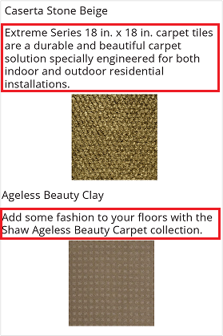
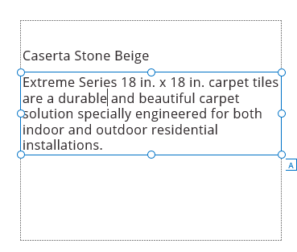
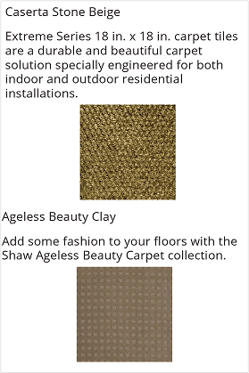

# Items met verschillende hoogten weergeven in een PowerApps-galerie
Als verschillende items in uw gegevensset verschillende hoeveelheden gegevens in hetzelfde veld bevatten, kunt u items volledig weergeven die meer gegevens bevatten zonder lege ruimte toe te voegen na items die minder gegevens bevatten. Voeg het galeriebesturingselement **Flexibele hoogte** toe en configureer dit zodat u:

* **Label**-besturingselementen zo kunt configureren dat ze worden vergroot of verkleind op basis van de inhoud.
* Elk besturingselement zo kunt plaatsen dat dit automatisch wordt weergegeven net onder het besturingselement erboven.

In deze zelfstudie geeft u gegevens weer over vloerproducten in het galeriebesturingselement **Flexibele hoogte**. De afbeelding van elk product wordt 5 pixels onder het overzicht weergegeven, ongeacht of het overzicht vijf of twee tekstregels bevat.

**Aanbevolen onderwerpen**

Als u nog nooit besturingselementen hebt toegevoegd aan een galerie, volgt u de stappen in [Een lijst met items weergeven](add-gallery.md) voordat u verdergaat met dit onderwerp.

## Gegevens toevoegen aan een lege app
1. Download [dit Excel-bestand](https://az787822.vo.msecnd.net/documentation/get-started-from-data/FlooringEstimates.xlsx), dat namen, overzichten en koppelingen naar afbeeldingen van vloerproducten bevat.

    

2. Upload het Excel-bestand naar een cloudopslagaccount, zoals OneDrive, Dropbox of Google Drive.

3. Klik of tik in PowerApps Studio op **Nieuw** in het menu **Bestand**.

4. Klik of tik onder **Lege app** op **Telefoonindeling**.

    

5. Voeg een verbinding toe aan de tabel **FlooringEstimates** in het Excel-bestand.

    Zie [Een verbinding toevoegen](add-data-connection.md) voor meer informatie.

## Gegevens toevoegen aan een galerie
1. Ga naar het tabblad **Invoegen**, klik of tik op **Galerie** en klik of tik vervolgens op **Flexibele hoogte**.

    
2. Pas de grootte van de galerie aan, zodat deze het hele scherm vult.

3. Stel de eigenschap **[Items](controls/properties-core.md)** van de galerie in op **FlooringEstimates**.

## De productnamen weergeven
1. Klik of tik linksboven in de galerie op het potloodpictogram om de galeriesjabloon te selecteren.

    

2. Selecteer de galeriesjabloon en voeg er een besturingselement **[Label](controls/control-text-box.md)** aan toe.

3. Stel de eigenschap **Text** van het besturingselement **Label** in op deze expressie: 
   **ThisItem.Name**

    

## De productoverzichten weergeven
1. Selecteer de galeriesjabloon en voeg nog een besturingselement **Label** toe. Plaatst dit besturingselement onder het eerste besturingselement **Label**.  

2. Stel de eigenschap **Text** van het besturingselement **Label** in op deze expressie:  **ThisItem.Overview**

3. Selecteer het tweede besturingselement **Label** en klik of tik op het pictogram met het naamkaartje op het tabblad **Inhoud** en wijzig de naam van het besturingselement in **OverviewText**.

    

4. Stel de eigenschap **AutoHeight** van het vak **OverviewText** in op **Waar**.

    Met deze stap zorgt u ervoor dat de grootte van het vak wordt aangepast aan de inhoud.

      

## De productafbeeldingen weergeven
1. Wijzig de grootte van de sjabloon, zodat deze twee keer zo lang is al eerst.

    U kunt besturingselementen eenvoudiger toevoegen aan de sjabloon terwijl u de app maakt. Deze wijziging heeft geen invloed op het uiterlijk van de app wanneer deze wordt uitgevoerd.

2. Terwijl u de galeriesjabloon hebt geselecteerd, voegt u het besturingselement **[Afbeelding](controls/control-image.md)** toe en plaatst u dit onder het vak **OverviewText**.

3. Zorg ervoor dat de eigenschap **Image** van het besturingselement **Afbeelding** is ingesteld op deze expressie: 
    **ThisItem.Image**

4. Stel de **[Y](controls/properties-core.md)**-eigenschap van het besturingselement **Afbeelding** in op basis van de positie en de grootte van het vak **OverviewText**, zoals in deze expressie:
    **OverviewText.Y + OverviewText.Height + 5**

    

Pas hetzelfde concept toe als u meer besturingselementen wilt toevoegen: stel de eigenschap **Y** van elk besturingselement in op basis van de eigenschappen **Y** en **Height** van het besturingselement erboven.

## Volgende stappen
Lees meer over het werken met een [galerie](working-with-forms.md)besturingselement en [formules](working-with-formulas.md).
