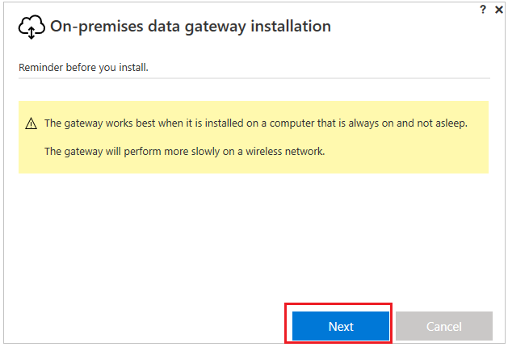
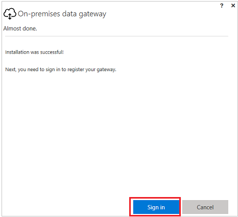
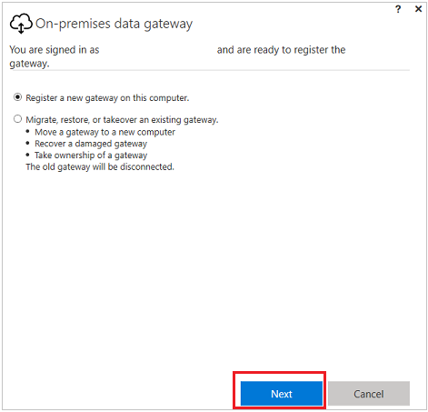
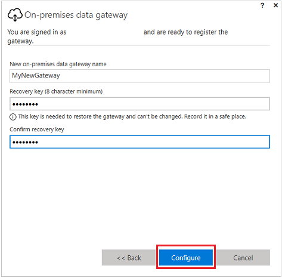
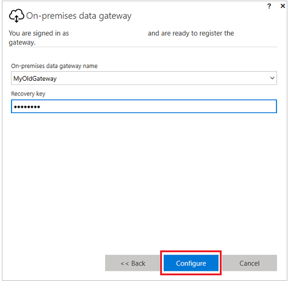
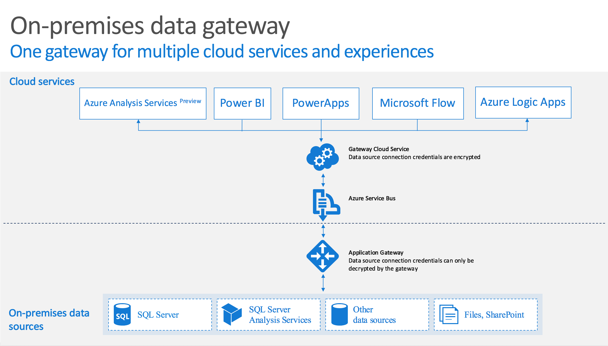

# Informatie over on-premises gegevensgateways voor Microsoft PowerApps
## Installatie en configuratie
**Vereisten**

Minimum:

* .NET 4.5 Framework
* 64-bits versie van Windows 7 of Windows Server 2008 R2 (of hoger)

Aanbevolen:

* 8-core CPU
* 8 GB geheugen
* 64-bits versie van Windows 2012 R2 (of hoger)

Bijkomstige overwegingen:

* U kunt een gateway niet installeren op een domeincontroller.
* U mag een gateway niet installeren op een computer, zoals een laptop, die kan worden uitgeschakeld, in de slaapstand kan gaan of niet is verbonden met internet omdat de gateway in die omstandigheden niet kan worden uitgevoerd. Bovendien nemen de prestaties van een gateway af bij gebruik van een draadloos netwerk.

**Een gateway installeren**

1. [Download het installatieprogramma](http://go.microsoft.com/fwlink/?LinkID=820931) en voer het uit.

    

2. Klik of tik op het eerste scherm van de installatiewizard op **Volgende** om de herinnering over de installatie van een gateway op een laptop te bevestigen.

    

3. Geef de locatie op waar u de gateway wilt installeren, schakel het selectievakje in om akkoord te gaan met de gebruiksvoorwaarden en de privacyverklaring en klik of tik op **Installeren**.

4. Klik of tik in de dialoogvensters van **Gebruikersaccountbeheer** op **Ja** om door te gaan.

5. Klik of tik op het volgende scherm van de wizard **Aanmelden**.

    

6. Klik of tik op de optie om een nieuwe gateway te registreren of om een bestaande gateway te migreren, te herstellen of over te nemen en klik of tik daarna op **Volgende**.

    

   * Configureer de gateway door een **naam** en een **herstelsleutel** te typen, op **Configureren** te klikken of te tikken en op **Sluiten** te klikken of te tikken.

       

       Geef een herstelsleutel op van ten minste acht tekens en bewaar deze op een veilige plaats. U hebt deze sleutel nodig als u de gateway wilt migreren, herstellen of overnemen.

   * Als u een bestaande gateway wilt migreren, herstellen of overnemen, geeft u de naam van de gateway en de herstelsleutel op, klikt of tikt u op **Configureren** en volgt u de aanwijzingen.

       

**De gateway opnieuw starten**

De gateway wordt uitgevoerd als een Windows-service, zodat u deze op verschillende manieren kunt stoppen en starten. U kunt bijvoorbeeld een opdrachtprompt met verhoogde bevoegdheden openen op de computer waarop de gateway wordt uitgevoerd en vervolgens een van deze opdrachten uitvoeren:

* Als u de service wilt stoppen, voert u deze opdracht uit: 
  **net stop PBIEgwService**

* Als u de service wilt starten, voert u deze opdracht uit: 
  **net start PBIEgwService**

**Een firewall of proxy configureren**

Voor informatie over het doorgeven van proxy-informatie voor uw gateway raadpleegt u [Proxy-instellingen configureren](https://docs.microsoft.com/power-bi/service-gateway-proxy).

U kunt controleren of uw firewall, of proxy, verbindingen mogelijk blokkeert door de volgende opdracht uit te voeren in een PowerShell-prompt. Deze opdracht test de verbinding met Azure Service Bus. Hiermee wordt alleen de netwerkverbinding getest en dit heeft niets te maken met de cloudserverservice of de gateway. Zo kunt u controleren of uw computer daadwerkelijk verbinding kan maken met internet.

**Test-NetConnection -ComputerName watchdog.servicebus.windows.net -Port 9350**

De resultaten moeten er ongeveer uitzien als in het volgende voorbeeld. Als **TcpTestSucceeded** niet **waar** is, wordt u mogelijk geblokkeerd door een firewall.

    ComputerName           : watchdog.servicebus.windows.net
    RemoteAddress          : 70.37.104.240
    RemotePort             : 5672
    InterfaceAlias         : vEthernet (Broadcom NetXtreme Gigabit Ethernet - Virtual Switch)
    SourceAddress          : 10.120.60.105
    PingSucceeded          : False
    PingReplyDetails (RTT) : 0 ms
    TcpTestSucceeded       : True

Als u grondig te werk wilt gaan, vervangt u de waarden **Computernaam** en **Poort** door de waarden die staan vermeld onder **Poorten configureren**, verderop in dit onderwerp.

De firewall blokkeert mogelijk ook de verbindingen tussen Azure Service Bus en de Azure-datacenters. Als dat het geval is, kunt u de IP-adressen van de datacenters voor uw regio op de goedgekeurde lijst plaatsen (deblokkeren). U vindt [hier](https://www.microsoft.com/download/details.aspx?id=41653) een lijst met IP-adressen voo Azure.

**Poorten configureren**

De gateway maakt een uitgaande verbinding naar Azure Service Bus. De gateway communiceert via uitgaande poorten: TCP 443 (standaard), 5671, 5672, 9350 t/m 9354. De gateway vereist geen inkomende poorten.

Meer informatie over [hybride oplossingen](https://azure.microsoft.com/documentation/articles/service-bus-fundamentals-hybrid-solutions/).

Het wordt aanbevolen de IP-adressen voor uw gegevensregio op de goedgekeurde lijst voor de firewall te plaatsen. Hiervoor kunt u de [lijst met IP-adressen van Microsoft Azure-datacenters](https://www.microsoft.com/download/details.aspx?id=41653) downloaden. Deze lijst wordt wekelijks bijgewerkt.

> [!NOTE]
> De adressen in de lijst met IP-adressen van Azure-datacenters worden vermeld in de [CIDR-notatie](http://whatismyipaddress.com/cidr). 10.0.0.0/24 betekent bijvoorbeeld niet 10.0.0.0 tot en met 10.0.0.24.

Hier volgt een lijst met de volledige domeinnamen die worden gebruikt door de gateway.

| Domeinnamen | Uitgaande poorten | Beschrijving |
| --- | --- | --- |
| *.analysis.windows.net |443 |HTTPS |
| *.login.windows.net |443 |HTTPS |
| *.servicebus.windows.net |5671-5672 |Advanced Message Queuing Protocol (AMQP) |
| *.servicebus.windows.net |443, 9350-9354 |Listeners op Service Bus Relay via TCP (vereist 443 voor het ophalen van tokens voor toegangsbeheer) |
| *.frontend.clouddatahub.net |443 |HTTPS |
| *.core.windows.net |443 |HTTPS |
| login.microsoftonline.com |443 |HTTPS |
| *.msftncsi.com |443 |Wordt gebruikt om de internetverbinding te testen als de gateway onbereikbaar is voor de Power BI-service. |

**Aanmeldingsaccount**

Gebruikers melden zich aan met een werk- of schoolaccount. Dit is uw organisatieaccount. Als u zich hebt aangemeld voor een Office 365-aanbieding en niet het e-mailadres van uw werk hebt opgegeven, kan dit eruit zien als nancy@contoso.onmicrosoft.com. Uw account binnen een cloudservice wordt opgeslagen in een tenant in Azure Active Directory (AAD). In de meeste gevallen komt de UPN van uw AAD-account overeen met het e-mailadres.

**Windows-serviceaccount**

De on-premises gegevensgateway is zo geconfigureerd dat *NT SERVICE\PBIEgwService* wordt gebruikt voor de aanmeldingsreferenties voor Windows-services. Standaard heeft deze gateway het recht zich aan te melden als een service. Dit is in de context van de computer waarop u de gateway installeert.

Dit is niet het account dat wordt gebruikt om verbinding te maken met on-premises gegevensbronnen of het werk- of schoolaccount waarmee u zich aanmeldt bij cloudservices.

Als u problemen ondervindt met uw proxyserver vanwege de verificatie, kunt u het Windows-serviceaccount wijzigen in het account van een domeingebruiker of een beheerde service zoals in de [proxyconfiguratie](https://docs.microsoft.com/power-bi/service-gateway-proxy#changing-the-gateway-service-account-to-a-domain-user) wordt beschreven.

## Beheer op tenantniveau 

Er is momenteel geen enkele locatie waar tenantbeheerders alle gateways kunnen beheren die andere gebruikers hebben geïnstalleerd en geconfigureerd.  Als u een tenantbeheerder bent, wordt u aangeraden de gebruikers in uw organisatie te vragen u als beheerder toe te voegen aan elke gateway die ze installeren. Hiermee kunt u alle gateways in uw organisatie beheren via de pagina Gateway-instellingen of via [PowerShell-opdrachten](https://docs.microsoft.com/power-bi/service-gateway-high-availability-clusters#powershell-support-for-gateway-clusters).

## Veelgestelde vragen
#### Algemeen
**Vraag:** Welke gegevensbronnen ondersteunt de gateway?  
**Antwoord:** vanaf nu:

* SQL Server
* SharePoint
* Oracle
* Informix
* Bestandssysteem
* DB2

**Vraag:** Heb ik een gateway nodig voor gegevensbronnen in de cloud, zoals SQL Azure?  
**Antwoord:** Nee. Een gateway maakt alleen verbinding met on-premises gegevensbronnen.

**Vraag:** Wat is de werkelijke naam van de gateway als Windows-service?  
**Antwoord:** In Services heet de gateway **Power BI Enterprise Gateway-service**.

**Vraag:** Zijn er inkomende verbindingen met de gateway vanuit de cloud?  
**Antwoord:** Nee. De gateway gebruikt uitgaande verbindingen naar Azure Service Bus.

**Vraag:** Wat gebeurt er als ik uitgaande verbindingen blokkeer? Wat moet ik openen?  
**Antwoord:** raadpleeg de bovenstaande lijst met poorten en hosts die de gateway gebruikt.

**Vraag:** Moet de gateway worden geïnstalleerd op dezelfde computer als de gegevensbron?  
**Antwoord:** Nee. De gateway maakt verbinding met de gegevensbron met behulp van de opgegeven verbindingsgegevens. U kunt de gateway in dit opzicht beschouwen als een clienttoepassing. De gateway moet enkel verbinding kunnen maken met de opgegeven servernaam.

**Vraag:** Wat de latentie voor het uitvoeren van query's in een gegevensbron vanuit de gateway? Wat is de beste architectuur?  
**Antwoord:** U kunt de netwerklatentie beperken door de gateway zo dicht mogelijk bij de gegevensbron te installeren. Als u de gateway op de daadwerkelijke gegevensbron kunt installeren, is de latentie minimaal. Datacenters zijn ook een overweging waard. Als uw service bijvoorbeeld het datacenter VS - west gebruikt en u SQL Server host in een virtuele machine van Azure, kunt u de Azure VM het beste ook in VS - west plaatsen. Zo wordt de latentie tot het minimum beperkt en voorkomt u kosten voor uitgaand verkeer op de virtuele Azure-machine.

**Vraag:** Zijn er vereisten voor de netwerkbandbreedte?  
**Antwoord:** Het wordt aanbevolen een netwerkverbinding met een goede doorvoer te gebruiken. Elke omgeving is anders en de hoeveelheid verzonden gegevens is van invloed op de resultaten. Door ExpressRoute te gebruiken, kunt u een bepaalde doorvoer garanderen tussen on-premises en de Azure-datacenters.

U kunt een hulpprogramma, de app [Azure Speed Test](http://azurespeedtest.azurewebsites.net/), gebruiken om de doorvoer te meten.

**Vraag:** Kan de Windows-gatewayservice worden uitgevoerd met een Azure Active Directory-account?  
**Antwoord:** Nee. De Windows-service moet een geldig Windows-account hebben. Standaard wordt deze uitgevoerd met de service-SID *NT SERVICE\PBIEgwService*.

**Vraag:** Hoe worden resultaten teruggezonden naar de cloud?  
**Antwoord:** Dit gebeurt via Azure Service Bus. Zie [Hoe het werkt](gateway-reference.md#how-the-gateway-works) voor meer informatie.

**Vraag:** Waar worden mijn referenties opgeslagen?  
**Antwoord:** De referenties die u voor een gegevensbron invoert, worden versleuteld opgeslagen in de gatewaycloudservice. De referenties worden on-premises versleuteld bij de gateway.

**Vraag:** Kan ik de gateway plaatsen in een perimeternetwerk (ook wel gedemilitariseerde zone of gescreend subnet genoemd)?  
**Antwoord:** De gateway vereist een verbinding met de gegevensbron. Als de gegevensbron zich niet in uw perimeternetwerk bevindt, kan de gateway mogelijk geen verbinding tot stand te brengen. Zo bevindt de computer waarop SQL Server wordt uitgevoerd, zich mogelijk niet in uw perimeternetwerk en kunt u geen verbinding maken met die computer via het perimeternetwerk. Als u de gateway in uw perimeternetwerk zou plaatsen, zou de gateway de computer waarop SQL Server wordt uitgevoerd niet kunnen bereiken.

#### Hoge beschikbaarheid/herstel na noodgevallen
**Vraag:** Zijn er plannen om scenario’s voor van hoge beschikbaarheid mogelijk te maken met de gateway?  
**Antwoord:** Dit staat op de roadmap, maar we hebben momenteel nog geen tijdlijn hiervoor.

**Vraag:** Welke opties zijn er beschikbaar voor herstel na noodgevallen?  
**Antwoord:** U kunt de herstelsleutel gebruiken om een gateway te herstellen of te verplaatsen. Geef de herstelsleutel op tijdens de installatie van de gateway.

**Vraag:** Wat het voordeel van de herstelsleutel?  
**Antwoord:** Deze biedt een manier om de gatewayinstellingen te migreren of te herstellen na een noodgeval.

#### Problemen oplossen
**Vraag:** Waar worden de logboeken van de gateway opgeslagen?  
**Antwoord:** Zie [Hulpmiddelen](gateway-reference.md#tools) verderop in dit onderwerp.

**Vraag:** Hoe kan ik zien welke query's worden verzonden naar de on-premises gegevensbron?  
**Antwoord:** U kunt querytracering inschakelen, dat ook de verzonden query's omvat. Vergeet niet om dit weer terug te veranderen in de oorspronkelijke waarde nadat de problemen zijn opgelost. Als u querytracering ingeschakeld laat, zijn de logboeken groter.

U kunt ook kijken welke hulpmiddelen uw gegevensbron biedt om query's te traceren. U kunt bijvoorbeeld Extended Events of SQL Profiler gebruiken voor SQL Server en Analysis Services.

## Hoe de gateway werkt

Wanneer een gebruiker een interactie uitvoert met een element dat is verbonden met een on-premises gegevensbron:  

1. De cloudservice creëert een query, samen met de versleutelde referenties voor de gegevensbron, en verzendt de query naar de wachtrij, zodat de gateway de query kan verwerken.

2. De gatewaycloudservice analyseert de query en stuurt de aanvraag naar [Azure Service Bus](https://azure.microsoft.com/documentation/services/service-bus/).

3. De on-premises gegevensgateway peilt Azure Service Bus om te kijken of er aanvragen liggen te wachten.

4. De gateway haalt de query op, ontsleutelt de referenties en maakt verbinding met de gegevensbron(nen) met behulp van die referenties.

5. De gateway stuurt de query voor uitvoering naar de gegevensbron.

6. De resultaten worden vanuit de gegevensbron teruggezonden naar de gateway en vervolgens naar de cloudservice. De service gebruikt vervolgens de resultaten.

## Problemen oplossen
#### Bijwerken naar de nieuwste versie
Er kunnen zich allerlei problemen voordoen als de gatewayversie verouderd is.  Het is een goede algemene gewoonte om ervoor te zorgen dat u de nieuwste versie gebruikt.  Als u de gateway een maand of langer niet hebt bijgewerkt, kunt u overwegen de nieuwste versie van de gateway te installeren en te kijken of het probleem zich nog steeds voordoet.

#### Fout: Kan gebruiker niet toevoegen aan groep.  (-2147463168   PBIEgwService   Prestatielogboekgebruikers   )
Deze fout kan optreden als u de gateway probeert te installeren op een domeincontroller, hetgeen niet wordt ondersteund. U moet de gateway implementeren op een computer die geen domeincontroller is.

## Hulpmiddelen
#### Logboeken van de gatewayconfigurator verzamelen
U kunt verschillende logboeken voor de gateway verzamelen. Begin altijd met de logboeken!

**Logboeken van installatieprogramma**

%localappdata%\Temp\On-premises_data_gateway_*.log

**Configuratielogboeken**

%localappdata%\Microsoft\on-premises gegevensgateway\GatewayConfigurator * .log

**Logboeken van de ondernemingsgatewayservice**

C:\Users\PBIEgwService\AppData\Local\Microsoft\on-premises gegevensgateway\Gateway*.log

**Gebeurtenislogboeken**

De gebeurtenislogboeken van de **on-premises gegevensgatewayservice** worden opgeslagen onder **Logboeken Toepassingen en Services**.

#### Traceren met Fiddler
[Fiddler](http://www.telerik.com/fiddler) is een gratis hulpprogramma van Telerik dat HTTP-verkeer bewaakt.  U kunt hiermee het verkeer tussen de Power BI-service en de clientcomputer bekijken. Het programma kan fouten en verwante informatie weergeven.
