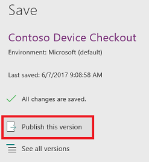

# Een app opslaan en publiceren in PowerApps
Wanneer u wijzigingen in een app opslaat, publiceert u deze automatisch alleen voor uzelf en voor anderen die bevoegd zijn om de app te bewerken. Als u klaar bent met het maken van wijzigingen, moet u de wijzigingen expliciet publiceren om deze beschikbaar te maken voor iedereen met wie de app wordt gedeeld.

Zie [Een app delen](share-app.md) voor informatie over het delen van een app.

## Wijzigingen opslaan in een app
Klik of tik in PowerApps Studio op **Opslaan** in het menu **Bestand** (aan de linkerkant) en volg een van deze stappen:

* Als u de app niet eerder hebt opgeslagen, geeft u een naam op voor de app en klikt of tikt u op **Opslaan**.

    
* Als de app eerder is opgeslagen, klikt of tikt u op **Opslaan**.  

    

PowerApps kan de app ook met regelmatige intervallen van 2 minuten opslaan. Als u de app één keer hebt opgeslagen, blijft PowerApps regelmatig een versie van de app opslaan zonder dat u op de knop Opslaan hoeft te klikken of tikken. Auteurs kunnen de instelling **Automatisch opslaan** in- of uitschakelen in het menu **Bestand** op het tabblad **Account**.

## Een app publiceren
1. Klik of tik in PowerApps Studio op **Opslaan** in het menu **Bestand** (aan de linkerkant) en klik of tik vervolgens op **Deze versie publiceren**.

    
2. Tik of klik in het dialoogvenster **Publiceren** op **Deze versie gebruiker** om de app te publiceren naar alle gebruikers met wie de app wordt gedeeld.

   

   > [!NOTE]
> We raden u aan uw app binnen zes maanden na de laatste publicatie bij te werken en/of opnieuw te publiceren, zodat deze synchroon blijft met de nieuwste versie van PowerApps. Als u de app niet binnen zes maanden bijwerkt en/of opnieuw publiceert, werkt de app mogelijk opeens niet meer zonder dat u daarvoor bent gewaarschuwd.

## De live-versie identificeren
Klik of tik op [powerapps.com](https://web.powerapps.com) op **Apps** in het menu **Bestand** (aan de linkerkant), klik of tik op het detailpictogram voor een app en klik of tik vervolgens op het tabblad **Versies**.

De **Live**-versie wordt gepubliceerd voor iedereen met wie de app wordt gedeeld. De meest recente versie van een app is alleen beschikbaar voor gebruikers die bevoegd zijn om de app te bewerken.

Als u de meest recente versie wilt publiceren, klikt of tikt u op **Deze versie publiceren** en klikt of tikt u vervolgens op **Deze versie publiceren** in het dialoogvenster **Publiceren**.

## Volgende stappen
* [De naam van een app wijzigen](set-name-tile.md) via powerapps.com.
* [Een app herstellen](restore-an-app.md) als er meerdere versies van een app zijn.
