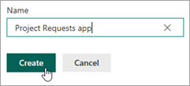
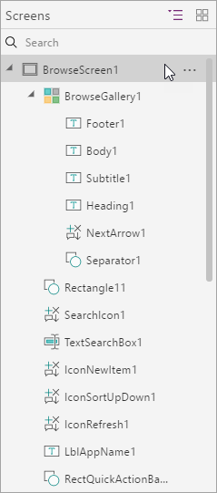
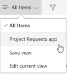
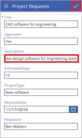

# Een app genereren om projectaanvragen af te handelen
> [!NOTE]
> Dit artikel maakt deel uit van een reeks zelfstudies over het gebruik van PowerApps, Microsoft Flow en Power BI met SharePoint Online. Lees de [inleiding tot de reeks](sharepoint-scenario-intro.md) zodat u een idee van het geheel krijgt en van de betreffende downloads.

De SharePoint-lijsten zijn gereed, dus we kunnen onze eerst app gaan maken en aanpassen. PowerApps is geïntegreerd met SharePoint, dus het is eenvoudig om rechtstreeks vanuit een lijst een eenvoudige *app met drie schermen* te genereren. Met deze app kunt u zowel overzichten als gedetailleerde informatie voor elk lijstitem bekijken, bestaande lijstitems bijwerken en nieuwe lijstitems maken. Als u een app rechtstreeks vanuit een lijst maakt, wordt de app als een *weergave* voor die lijst weergegeven. U kunt de app vervolgens in een browser uitvoeren, en tevens op een mobiele telefoon.

> [!TIP]
> Het [downloadpakket](https://aka.ms/o4ia0f) voor dit scenario omvat een voltooide versie van deze app: project-requests-app.msapp.

## Stap 1: Een app genereren op basis van een SharePoint-lijst

1. Klik of tik in de lijst **Projectaanvragen** die u hebt gemaakt op **PowerApps** en vervolgens op **App maken**.
   
    

2. Geef de app een naam, bijvoorbeeld Projectaanvraag-app, en klik of tik op **Create**. Als de app klaar is, wordt deze geopend in PowerApps Studio voor internet.
   
    

## Stap 2: De app in PowerApps Studio controleren

1. In PowerApps Studio toont het linker navigatiedeelvenster standaard een hiërarchische weergave van de schermen en besturingselementen van de app.
   
    

2. Klik of tik op het miniatuurpictogram om weergaven te schakelen.
   
    

3. Klik of tik op een scherm om het in het middelste deelvenster te bekijken. Er zijn drie schermen:
   
    (a). Het **bladerscherm**: voor het bladeren in, sorteren en filteren van gegevens die uit de lijst zijn opgehaald.
    
    (b). Het **detailscherm**: voor het weergeven van meer informatie over een item.
    
    (c). Het scherm voor **bewerken/maken**: waar u een bestaand item bewerkt of een nieuw item maakt.
      
      

## Stap 3: Het bladerscherm van de app aanpassen

1. Klik of tik op het bladerscherm.
   
    Het scherm heeft een *indeling* met een *galerie* voor het weergeven van lijstitems en andere *besturingselementen*, zoals een zoekbalk en een sorteerknop.

2. Selecteer de galerie **BrowseGallery1** door op een record te klikken of tikken, behalve de eerste record.
   
    

3. Klik in het rechterdeelvenster onder **eigenschappen** op **Project aanvragen**. 

4. Werk de velden bij zodat ze overeenkomen met de volgende lijst:
   
   * **RequestDate**

   * **Requestor**

   * **Title**

     

5. Selecteer de eigenschap **Items**, waarbij **BrowseGallery1** nog steeds is geselecteerd.
   
    

6. Wijzig de formule in **SortByColumns(Filter('Projectaanvragen', StartsWith(Title, TextSearchBox1.Text)), "Title", If(SortDescending1, Descending, Ascending))**.
   
    
   
    Hiermee kunt u op het veld **Title** sorteren en zoeken in plaats van op de uitgekozen standaardwaarde. Zie [De formule nader bekeken](#formula-deep-dive) voor meer informatie.

6. Klik of tik op **Bestand** en vervolgens op **Opslaan**. Klik of tik op  om naar de app terug te gaan.

## Stap 4: het detailscherm en het scherm voor bewerken van de app controleren
1. Klik of tik op het detailscherm.
   
    Dit scherm heeft een andere indeling. Het bevat een *weergaveformulier* om de details te tonen van een in de galerie geselecteerd item. Het bevat besturingselementen om items te bewerken en verwijderen en om terug te gaan naar het bladerscherm.
   
    

4. Klik of tik op het scherm voor bewerken.
   
    Dit scherm bevat een *bewerkingsformulier* waar u het geselecteerde item kunt bewerken of een nieuw item kunt maken (als u hier rechtstreeks vanuit het bladerscherm terechtkomt). Het bevat besturingselementen om wijzigingen op te slaan of te negeren.

    

## Stap 5: De app vanuit de lijst uitvoeren

1. Klik of tik in de lijst **Projectaanvragen** op **Alle items** en vervolgens op **App Projectaanvragen**.
   
    
2. Klik op **Openen**. Hiermee wordt de app in een nieuw browsertabblad geopend.
   
    

3. Klik of tik in de app op  voor het eerste item in de bladergalerie.
   
    

4. Klik of tik op  om het item te bewerken.

5. Werk het veld **Description** bij; wijzig het laatste woord ('groep') in 'team' en klik of tik vervolgens op 
   
   

6. Sluit het browsertabblad.

7. Ga terug naar de lijst **Projectaanvragen**, klik of tik op **App Projectaanvragen** en vervolgens op **Alle items**.
   
   
8. Controleer de wijziging die u hebt gemaakt vanuit de app.
   
    

Dit is een tamelijk eenvoudige app en we hebben slechts een paar eenvoudige aanpassingen gedaan. U ziet echter dat het mogelijk is snel iets leuks te maken. We gaan door naar de volgende taak, maar bekijk rustig de app nog even om te zien hoe de besturingselementen en de formules samenwerken om de app te laten functioneren.

## De formule nader bekeken
Deze sectie is optioneel, maar het biedt meer inzicht in de werking van de formules. In stap 3 van deze taak hebben we de formule gewijzigd voor de eigenschap **Items** van **BrowseGallery1**. We hebben met name de sorteer- en zoekfunctie gewijzigd zodat het veld **Title** kan worden gebruikt in plaats van het door PowerApps gekozen veld. Hier ziet u de gewijzigde formule:

**SortByColumns ( Filter ( 'Projectaanvragen', StartsWith ( Title, TextSearchBox1.Text ) ), "Title", If ( SortDescending1, Descending, Ascending ) )**

Wat doet deze formule? De formule stelt de gegevensbron vast die in de galerie wordt weergegeven, filtert de gegevens die zijn gebaseerd op in het zoekvak ingevoerde tekst en sorteert de resultaten op basis van de sorteerknop in de app. De formule maakt voor de uitvoering gebruik van *functies*. Functies gebruiken parameters (invoer), voeren een bewerking uit (bijvoorbeeld filteren) en geven een waarde als resultaat terug (uitvoer):

* De [functie **SortByColumns**](functions/function-sort.md) sorteert een tabel die is gebaseerd op een of meer kolommen.
* De [functie **Filter**](functions/function-filter-lookup.md) zoekt de records in een tabel die aan een formule voldoen die u hebt opgegeven.
* De [functie **StartsWith**](functions/function-startswith.md) test of een tekenreeks begint met een andere tekenreeks.
* De [functie **If**](functions/function-if.md) retourneert een waarde als een voorwaarde waar is en retourneert een andere waarde als dezelfde voorwaarde onwaar is.

Als de functies samen in een formule worden gestopt, gebeurt het volgende:

1. Als u tekst in het zoekvak invoert, vergelijkt de functie **StartsWith** de tekst met het begin van elke tekenreeks in de kolom **Title** van de lijst.
   
    **StartsWith ( Title, TextSearchBox1.Text )**
   
    Als u bijvoorbeeld 'app' in het zoekvak invoert, ziet u een aantal resultaten, waaronder items die beginnen met 'Apparaat' en 'App'. De items met 'Mobiele apparaten' ziet u niet omdat deze niet *beginnen met* 'app'.

2. De functie **Filter** *geeft als resultaat* rijen terug uit de tabel **Projectaanvragen**. Als het zoekvak geen tekst ter vergelijking bevat, geeft **Filter** alle rijen als resultaat terug.
   
    **Filter ( 'Projectaanvragen', StartsWith ( Title, TextSearchBox1.Text )**

3. De functie **If** kijkt of de variabele **SortDescending1** is ingesteld op waar of onwaar (ingesteld door de sorteerknop in de app). De functie geeft vervolgens de waarde **Aflopend** of **Oplopend** als resultaat terug.
   
    **If ( SortDescending1, Aflopend, Oplopend )**

4. De functie **SortByColumns** kan de galerie nu sorteren. In dit geval wordt er gesorteerd op basis van het veld **Title**, maar dit kan een ander veld zijn dan het veld waarnaar u zoekt.

Als u dit nog allemaal kunt volgen, dan hebt u waarschijnlijk een beter idee van hoe de formule werkt en hoe u functies en andere elementen kunt combineren om uw apps naar wens te laten functioneren. Zie [Formuleverwijzingen voor PowerApps](formula-reference.md) voor meer informatie.

## Volgende stappen
De volgende stap in deze reeks zelfstudies bestaat uit het [maken van een stroom voor het beheren van projectgoedkeuringen](sharepoint-scenario-approval-flow.md).

