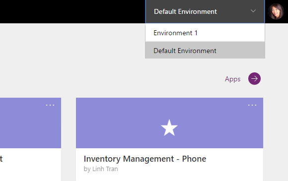

# Werken met omgevingen en Microsoft PowerApps
U kunt met PowerApps in verschillende omgevingen werken en eenvoudig schakelen tussen omgevingen. Zie [Overzicht van omgevingen](../../administrator/environments-overview.md) voor een overzicht van omgevingen. Daarin wordt in detail uitgelegd waarom u omgevingen gebruikt en hoe u omgevingen kunt maken en beheren. In dit artikel komen de volgende onderwerpen over omgevingen aan bod:

* Het overschakelen naar een andere omgeving op powerapps.com
* Het maken van een app in de juiste omgeving
* Het bekijken van een app in de juiste omgeving

## Overschakelen naar een andere omgeving
Wanneer u zich aanmeldt voor PowerApps en u zich voor het eerst aanmeldt op powerapps.com, zit u waarschijnlijk in een standaardomgeving. U kunt dit zien in de rechterbovenhoek van de pagina.

De *standaardomgeving* is voor iedereen toegankelijk. U kunt beginnen met het maken van apps in deze omgeving en uw apps met anderen delen. Mogelijk hebt u ook toegang tot andere omgevingen, zoals de omgevingen die u [zelf hebt gemaakt](../../administrator/environments-administration.md) of de omgevingen die door anderen zijn gemaakt, maar waartoe u wel toegang hebt. U kunt tussen omgevingen schakelen door te klikken op de vervolgkeuzelijst voor de omgeving in de rechterbovenhoek en een andere omgeving te selecteren. Dit voorbeeld toont het schakelen van *Standaardomgeving* naar *Omgeving 1*.

Als u overschakelt naar een andere omgeving (zoals Omgeving 1), ziet u alle apps die u hebt gemaakt of waartoe u toegang hebt in deze nieuwe omgeving.

## Apps maken in de juiste omgeving
U kunt apps maken in een omgeving die u maakt of waarvoor u toegang hebt gekregen. Voor het maken van uw eigen omgeving hebt u echter een [specifiek abonnement](../../administrator/pricing-billing-skus.md) nodig. Voordat u een app maakt, moet u altijd **de gewenste omgeving voor de app selecteren**. Anders moet u de app later weer overzetten naar een andere omgeving.

Voer een van de volgende handelingen uit om een app te maken in de juiste omgeving:

- Als PowerApps Studio niet is geopend, [meld u zich aan](http://web.powerapps.com), selecteert u de omgeving waarin u uw app wilt maken, selecteert u **Apps** aan de linkerkant en selecteert u vervolgens **Een app maken**.

- Als PowerApps Studio is geopend, selecteert u de omgeving opnieuw in de rechterbovenhoek.

5. Op de pagina **Account** selecteert u **Wijzigen** naast de naam van de huidige omgeving.

6. Selecteer de omgeving waarin u de app wilt maken.

    

7. Selecteer **Nieuw** om te beginnen met het maken van een app. Uw app bevindt zich nu in de omgeving die u hebt geselecteerd in stap 6.

    

## Apps weergeven in de juiste omgeving
Of u nu werkt in [powerapps.com](http://web.powerapps.com) of PowerApps Studio, de lijst met apps, verbindingen, enzovoort die u ziet, wordt altijd gefilterd op basis van de omgeving die in de vervolgkeuzelijst is geselecteerd. Controleer altijd of de juiste omgeving is geselecteerd als u de gewenste app(s) niet ziet.

Zie [dit overzicht](../../administrator/environments-overview.md) voor meer informatie over omgevingen.
