# Over variabelen in PowerApps
Als u andere programmeerprogramma's zoals Visual Basic of JavaScript hebt gebruikt, vraagt u zich misschien het volgende af: **waar zijn de variabelen?** PowerApps is iets anders, en er is ook een andere benadering voor nodig. In plaats van dat u een variabele gebruikt, moet u zich afvragen: **wat zou ik doen in Excel?**

In andere hulpprogramma's hebt u mogelijk expliciet een berekening uitgevoerd en het resultaat opgeslagen in een variabele. In PowerApps en Excel worden formules echter automatisch opnieuw berekend wanneer de invoergegevens worden gewijzigd, dus is het doorgaans niet nodig om variabelen te maken en bij te werken. Als u deze benadering zo vaak mogelijk gebruikt, wordt het eenvoudiger om uw app te maken, begrijpen en onderhouden.

In sommige gevallen moet u variabelen gebruiken in PowerApps. Hiermee wordt het Excel-model uitgebreid door [gedragsformules](working-with-formulas-in-depth.md) toe te voegen. Deze formules worden uitgevoerd wanneer een gebruiker bijvoorbeeld een knop selecteert. Binnen een gedragsformule is het vaak nuttig om een variabele in te stellen voor gebruik in andere formules.

Over het algemeen is het beter om het gebruik van variabelen te vermijden. Toch is het gewenste resultaat soms alleen mogelijk met een variabele.

## Excel vertalen naar PowerApps
### Excel
Laten we bekijken hoe Excel werkt. Een cel kan een waarde bevatten, zoals een getal of een tekenreeks, of een formule die is gebaseerd op de waarden van andere cellen. Nadat de gebruiker een andere waarde in een cel heeft ingevoerd, worden eventuele formules die afhankelijk zijn van de nieuwe waarde opnieuw berekend. Voor dit gedrag hoeft u niets te programmeren.

Excel beschikt niet over variabelen. De waarde van een cel met een formule wordt gewijzigd op basis van de invoer, maar er is geen manier om het resultaat van een formule te onthouden en op te slaan in een cel of ergens anders. Als u de waarde van een cel wijzigt, wordt mogelijk het hele werkblad gewijzigd en gaan eerder berekende waarden verloren.  Gebruikers van Excel kunnen cellen kopiëren en plakken, maar dit moet handmatig worden gedaan en is niet mogelijk met formules.

### PowerApps
Apps die u in PowerApps maakt, hebben een werking die lijkt op die van Excel. In plaats van cellen bij te werken, kunt u waar u maar wilt op het scherm besturingselementen toevoegen en deze een naam geven om in formules te gebruiken.

U kunt het Excel-gedrag bijvoorbeeld repliceren in een app door een besturingselement **[Label](controls/control-text-box.md)** met de naam **Tekstvak1** en twee besturingselementen **[Tekstinvoer](controls/control-text-input.md)** met de namen **Tekstinvoer1** en **Tekstinvoer2** toe te voegen. Als u vervolgens de  **[tekst](controls/properties-core.md)**eigenschap van **Tekstvak1** instelt op **Tekstinvoer1 + Tekstinvoer2**, wordt altijd automatisch de som van de getallen in **Tekstinvoer1** en **Tekstinvoer2** weergegeven.

Het besturingselement **Tekstvak1** is geselecteerd met de **[tekst](controls/properties-core.md)**formule in de formulebalk bovenaan het scherm.  Hier zien we de formule **Tekstinvoer1 + Tekstinvoer2**.  Deze formule maakt een afhankelijkheid tussen deze besturingselementen, net zoals er afhankelijkheden worden gemaakt tussen de cellen in een Excel-werkmap.  Laten we de waarde van **Tekstinvoer1** wijzigen:

De formule voor **Tekstvak1** is automatisch herberekend. De nieuwe waarde wordt nu weergegeven.

U kunt in PowerApps formules niet alleen gebruiken om de primaire waarde van een besturingselement te bepalen, maar ook de eigenschappen, zoals de opmaak. In het volgende voorbeeld worden met een formule voor de eigenschap **[Color](controls/properties-color-border.md)** van het label negatieve waarden automatisch rood weergegeven. De **[Als](functions/function-if.md)**-functie ziet er waarschijnlijk bekend uit van Excel:
 **Als( Waarde(Tekstvak1.Tekst) < 0, Rood, Zwart )**

Als het resultaat van onze berekening in **Tekstvak1.Tekst** negatief is, wordt het getal rood weergegeven:

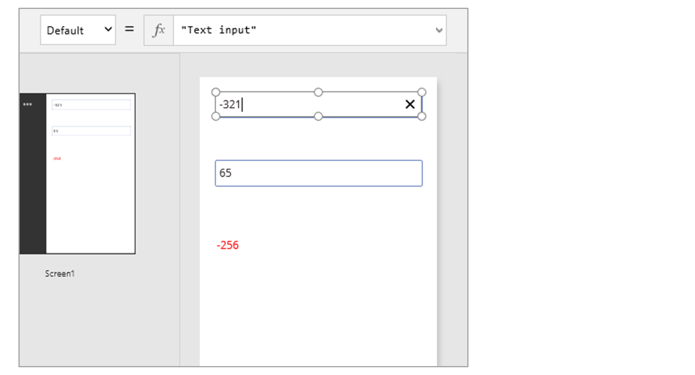

U kunt formules gebruiken voor een groot aantal scenario's:

* Door de GPS-functie van uw apparaat te gebruiken, kan een besturingselement voor kaarten en een formule die gebruikmaakt van **Location.Latitude** en **Location.Longitude** uw huidige locatie weergeven.  Op de kaart wordt automatisch uw locatie bijgehouden terwijl u zich verplaatst.
* Andere gebruikers kunnen [gegevensbronnen](working-with-data-sources.md) bijwerken.  Anderen in uw team kunnen bijvoorbeeld items in een SharePoint-lijst bijwerken.  Wanneer u een gegevensbron vernieuwt, worden eventuele afhankelijke formules automatisch opnieuw berekend om de bijgewerkte gegevens weer te geven. In het voorbeeld kunt u ook een **[item](controls/properties-core.md)**eigenschap uit de galerie aan de formule **Filter (SharePointList)** toevoegen. Deze geeft automatisch de nieuwe gefilterde set [records](working-with-tables.md#records) weer.

### Voordelen
Het gebruik van formules om apps te bouwen biedt veel voordelen:

* Als u Excel kent, kent u PowerApps. Het model en de formuletaal zijn hetzelfde.
* Als u andere programmeerprogramma's hebt gebruikt, weet u misschien hoeveel code u voor deze voorbeelden nodig zou hebben.  In Visual Basic zou u een gebeurtenis-handler moeten schrijven voor de wijzigingsgebeurtenis op elk besturingselement voor tekstinvoer.  De code voor het uitvoeren van de berekeningen is overbodig en zou mogelijk niet meer gesynchroniseerd zijn, of u zou een algemene subroutine moeten schrijven.  In PowerApps bereikt u dit met een enkele formule die uit één regel bestaan.
* Om te weten waar de tekst in **Tekstvak1** vandaan komt, weet u precies wat u moet bekijken: de formule in de **[tekst](controls/properties-core.md)**eigenschap.  Er is geen andere manier om de tekst van dit besturingselement te beïnvloeden.  In een traditioneel programmeerprogramma kan elke gebeurtenis-handler of subroutine de waarde van het label waar dan ook in het programma wijzigen.  Hierdoor kan het lastiger worden om te bepalen waar en wanneer een variabele is gewijzigd.
* Als gebruikers een schuifregelaar aanpassen en vervolgens van gedachten veranderen, kunnen ze de schuifregelaar terugzetten naar de oorspronkelijke waarde.  Het is dan alsof er nooit iets is gebeurd: de app bevat dezelfde besturingselementwaarden als voorheen.  Het heeft geen gevolgen om te experimenteren en u af te vragen 'wat als', net als in Excel.  

Over het algemeen is het handiger om een effect te bewerkstelligen met behulp van een formule. Laat de formule-engine in PowerApps het werk voor u doen.  

## Weten wanneer u variabelen gebruikt
Laten we eens proberen hoe het werkt als we een eenvoudige optelsom willen om een voorlopig totaal te krijgen. Als u een knop **Toevoegen** selecteert, voegt u een getal toe aan het voorlopige totaal. Als u een knop **Wissen** selecteert, zet u het voorlopige totaal op nul.

Voor onze optelsom wordt iets gebruikt dat niet bestaat in Excel: een knop. In deze app is het niet mogelijk om alleen formules te gebruiken om het voorlopige totaal te berekenen, omdat de waarde ervan afhankelijk is van een reeks acties die door de gebruiker wordt uitgevoerd. In plaats daarvan moet het voorlopige totaal worden geregistreerd en handmatig worden bijgewerkt. In de meeste programmeerprogramma's worden deze gegevens opslagen in een *variabele*.    

Soms hebt u een variabele nodig om uw app naar wens te laten werken.  Maar er geldt nog enig voorbehoud voor deze benadering:

* Het voorlopige totaal moet handmatig worden bijgewerkt. Het wordt niet automatisch herberekend.
* Het voorlopige totaal kan niet meer worden berekend op basis van de waarden van andere besturingselementen. Dit is afhankelijk van hoe vaak de gebruiker de knop **Toevoegen** heeft geselecteerd en welke waarde er elke keer in het besturingselement voor tekstinvoer was ingevuld. Heeft de gebruiker 77 ingevoerd en twee keer **Toevoegen** geselecteerd of is er 24 en 130 opgegeven voor elke toevoeging? Dat weet u niet als het totaal op 154 staat.
* Wijzigingen in het totaal kunnen op meerdere manieren tot stand zijn gekomen. In dit voorbeeld wordt het totaal bijgewerkt aan de hand van de knop **Toevoegen** en de knop **Wissen**. Welke knop veroorzaakt het probleem als de app niet naar verwachting functioneert?

## Een globale variabele maken
Om onze optelsom te maken, hebben we een variabele nodig voor het voorlopige totaal. De eenvoudigste variabelen om mee te werken in PowerApps zijn *globale variabelen*.  

De werking van globale variabelen:

* U stelt de waarde van de globale variabele in met de functie **[Instellen](functions/function-set.md)**.  **Set( MijnVar, 1 )** stelt de globale variabele **MijnVar** in op de waarde **1**.
* U gebruikt de globale variabele door te verwijzen naar de naam die is gebruikt in de functie **Set**.  In dit geval retourneert **MijnVar** **1**.
* Globale variabelen kunnen uit een willekeurige waarde bestaan, waaronder tekenreeksen, getallen, records en [tabellen](working-with-tables.md).

Laten we onze optelsom opnieuw bouwen met een globale variabele:

1. Voeg een tekstinvoerbesturingselement met de naam **Tekstinvoer1** en twee knoppen met de naam **Knop1** en **Knop2** toe.

2. Stel de **[tekst](controls/properties-core.md)**eigenschap van **Knop1** in op **"Toevoegen"** en stel de **tekst**eigenschap van **Knop2** in op **"Wissen"**.

3. Als het voorlopige totaal moet worden bijgewerkt wanneer een gebruiker de knop **Toevoegen** selecteert, stelt u de eigenschap **[OnSelect](controls/properties-core.md)** in op deze formule:
   
    **Set( RunningTotal, RunningTotal + Text1 )**
   
    De eerste keer dat de gebruiker de knop **Optellen** selecteert en **[Set](functions/function-set.md)** wordt aangeroepen, wordt **RunningTotal** gemaakt met de standaardwaarde *leeg*.  Dit wordt beschouwd als een nul.
   
    
4. Om het voorlopige totaal in te stellen op **0** wanneer de gebruiker de knop **Wissen** selecteert, stelt u de eigenschap **[OnSelect](controls/properties-core.md)** in op deze formule:
   
    **Set( RunningTotal, 0 )**
   
    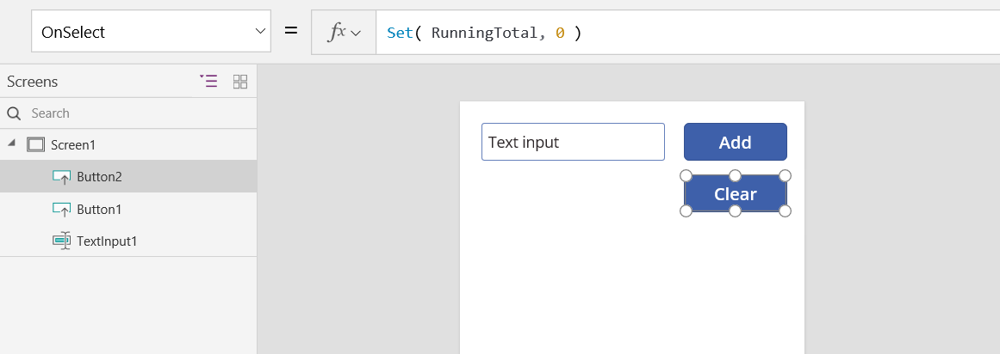
5. Voeg een besturingselement **[Label](controls/control-text-box.md)** toe en stel de eigenschap **[Text](controls/properties-core.md)** ervan in op **RunningTotal**.
   
    Deze formule wordt automatisch opnieuw berekend en de waarde van **RunningTotal** wordt weergegeven op basis van de knoppen die de gebruiker selecteert.
   
    
6. Bekijk een voorbeeld van de app. U ziet de optelfunctie zoals hierboven is beschreven.  Voer een getal in het tekstvak in en druk een paar keer op de knop **Optellen**.  Wanneer u klaar bent, kunt u terugkeren naar de ontwerpmogelijkheden met behulp van de Esc-toets.  
   
    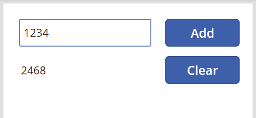
7. Als u de waarde van de globale variabele wilt weergeven, selecteert u het menu **Bestand** en selecteert u in het linkerdeelvenster **Variabelen**.
   
    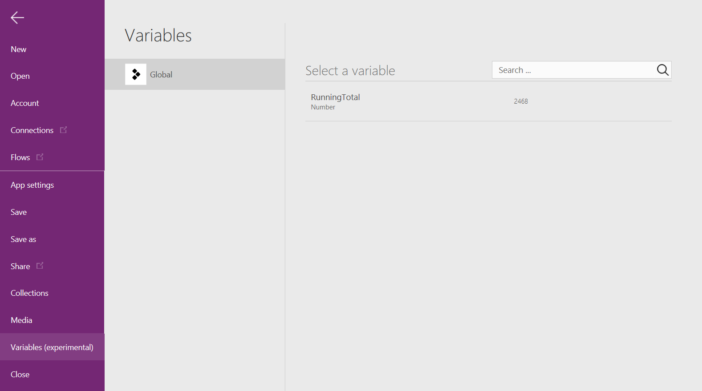
8. Selecteer de variabele voor een overzicht van alle locaties waar deze wordt gedefinieerd en gebruikt.
   
    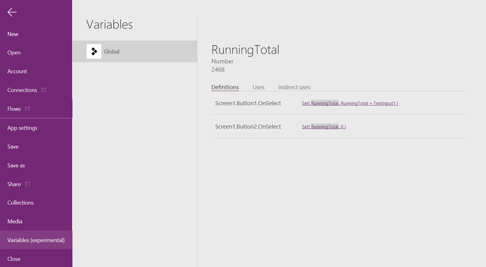

## Typen variabelen
Er zijn drie soorten variabelen in PowerApps:

| Type variabelen | Scope | Beschrijving | Functions |
| --- | --- | --- | --- |
| Globale variabelen |App |Zijn het eenvoudigst te gebruiken.  Bevatten een getal, tekststring, Boolean, record, tabel, enz. waarnaar kan worden verwezen vanuit een willekeurige plaats in de app. |[**Set**](functions/function-set.md) |
| Contextvariabelen |Scherm |Ideaal voor het doorgeven van waarden aan een scherm, zoals in andere talen parameters dat aan procedures doen.  Er kan alleen naar worden verwezen vanuit één scherm. |[**UpdateContext**](functions/function-navigate.md) |
| Verzamelingen |App |Bevatten een tabel waarnaar kan worden verwezen vanuit een willekeurige plaats in de app.  Hiermee kan de inhoud van de tabel worden gewijzigd in plaats van deze als geheel in te stellen. Kan worden opgeslagen op het lokale apparaat voor later gebruik. |[**Collect**](functions/function-savedata-loaddata.md) enz. |

Alle variabelen worden impliciet gemaakt bij gebruik in de functies **Set**, **UpdateContext**, **Navigate** of **Collect**.  Er is geen expliciete declaratie van variabelen, zoals in andere programmeertalen.  De typen van de variabelen worden ook impliciet afgeleid van de waarden die erin worden geplaatst.

Alle variabelen worden bewaard in het geheugen terwijl de app wordt uitgevoerd.  Wanneer de app wordt gesloten, gaan de waarden die zich in de variabelen bevinden, verloren.  U kunt de inhoud van een variabele opslaan in een gegevensbron met de functies **Patch** of **Collect** of, in het geval van verzamelingen, kunt u op het lokale apparaat opslaan met de functie **SaveData**.  Wanneer de app de eerste keer wordt geladen, hebben alle variabelen de waarde *leeg*.

Met de naam van de variabele kunt u de waarde lezen.  Wanneer bijvoorbeeld eenmaal gedefinieerd met **Set (MijnKleur, rood)**, kunt u gewoon **MijnVar** overal gebruiken waar een kleurwaarde kan worden gebruikt en wordt die vervangen door **rood**.  Het is mogelijk om een globale variabele of een verzameling met dezelfde naam als een contextvariabele te hebben.  In dit geval heeft de contextvariabele voorrang.  U kunt nog steeds verwijzen naar de globale variabele of een verzameling met behulp van de [ondubbelzinnigheidsoperator](functions/operators.md#disambiguation-operator) **@[MyColor]**.

## Een contextvariabele maken
Bekijk hoe onze optelsom zou worden gemaakt met een contextvariabele in plaats van een globale variabele.    

Hoe contextvariabelen werken:

* Contextvariabelen kunt u maken en instellen met behulp van de functie **[UpdateContext](functions/function-updatecontext.md)**.  Als een contextvariabele nog niet bestaat tijdens de eerste update, wordt deze gemaakt met de standaardwaarde *leeg*.
* Contextvariabelen kunt u maken en instellen met records. In andere programmeerprogramma's gebruikt u doorgaans "=" voor toewijzingen, zoals in "x = 1".  Voor contextvariabelen gebruikt u in plaats daarvan **{x: 1}**. Wanneer u een contextvariabele gebruikt, gebruikt u meteen de naam ervan.  
* U kunt een contextvariabele ook instellen wanneer er een scherm weergegeven, met behulp van de functie **[Navigate](functions/function-navigate.md)**. Als u een scherm als een soort procedure of subroutine beschouwt, is dit vergelijkbaar met de parameter die wordt doorgegeven in andere programmeerprogramma's.
* Behalve voor **[Navigate](functions/function-navigate.md)** zijn contextvariabelen beperkt tot de context van een enkel scherm. Vandaar de naam.  Het is niet mogelijk om ze buiten deze context te gebruiken of in te stellen.
* Contextvariabelen kunnen uit een willekeurige waarde bestaan, waaronder tekenreeksen, getallen, records en [tabellen](working-with-tables.md).

Laten we onze optelsom opnieuw bouwen met een contextvariabele:

1. Voeg een tekstinvoerbesturingselement met de naam **Tekstinvoer1** en twee knoppen met de naam **Knop1** en **Knop2** toe.

2. Stel de **[tekst](controls/properties-core.md)**eigenschap van **Knop1** in op **"Toevoegen"** en stel de **tekst**eigenschap van **Knop2** in op **"Wissen"**.

3. Als het voorlopige totaal moet worden bijgewerkt wanneer een gebruiker de knop **Toevoegen** selecteert, stelt u de eigenschap **[OnSelect](controls/properties-core.md)** in op deze formule:
   
    **UpdateContext( { RunningTotal: RunningTotal + Text1 } )**
   
    De eerste keer dat de gebruiker de knop **Optellen** selecteert en **[UpdateContext](functions/function-updatecontext.md)** wordt aangeroepen, wordt **RunningTotal** gemaakt met de standaardwaarde *leeg*.  Dit wordt beschouwd als een nul.
   
    
4. Om het voorlopige totaal in te stellen op **0** wanneer de gebruiker de knop **Wissen** selecteert, stelt u de eigenschap **[OnSelect](controls/properties-core.md)** in op deze formule:
   
    **UpdateContext( { RunningTotal: 0 } )**
   
    **[UpdateContext](functions/function-updatecontext.md)** wordt opnieuw gebruikt met de formule **UpdateContext( { RunningTotal: 0 } )**.
   
    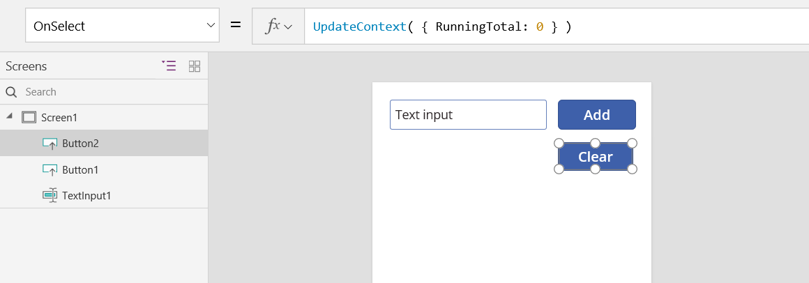
5. Voeg een besturingselement **[Label](controls/control-text-box.md)** toe en stel de eigenschap **[Text](controls/properties-core.md)** ervan in op **RunningTotal**.
   
    Deze formule wordt automatisch opnieuw berekend en de waarde van **RunningTotal** wordt weergegeven op basis van de knoppen die de gebruiker selecteert.
   
    
6. Bekijk een voorbeeld van de app. U ziet de optelfunctie zoals hierboven is beschreven.  Voer een getal in het tekstvak in en druk een paar keer op de knop **Optellen**.  Wanneer u klaar bent, kunt u terugkeren naar de ontwerpmogelijkheden met behulp van de Esc-toets.  
   
    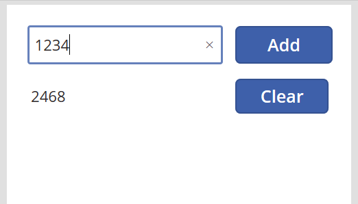
7. U kunt de waarde van een contextvariabele instellen tijdens het navigeren naar een scherm.  Dit is handig voor het doorgeven van 'context' of 'parameters' van het ene scherm naar de andere.  Voeg een nieuw scherm in en voeg een knop in met de eigenschap **OnSelect** ingesteld op:
   
    **Navigate( Screen1, None, { RunningTotal: -1000 } )**
   
    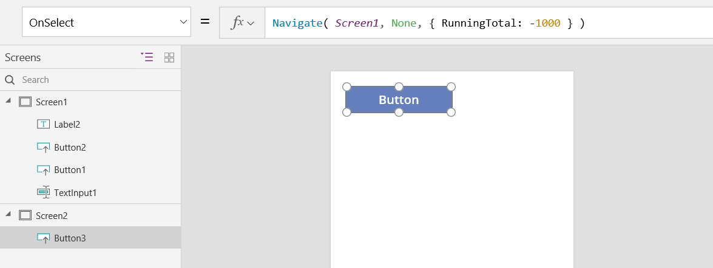
   
    Wanneer u deze knop selecteert op **Screen2** (wat u kunt doen tijdens het ontwerpen als u de knop tegen het einde selecteert), wordt **Screen1** weergegeven en ook de contextvariabele **RunningTotal** ingesteld op -1000.
   
    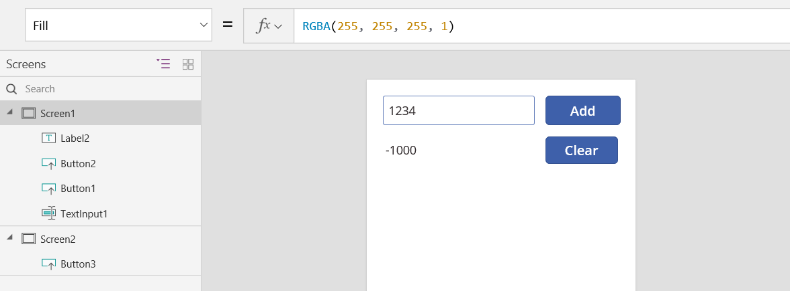
8. Als u de waarde van de contextvariabele wilt weergeven, selecteert u het menu **Bestand** en selecteert u in het linkerdeelvenster **Variabelen**.
   
    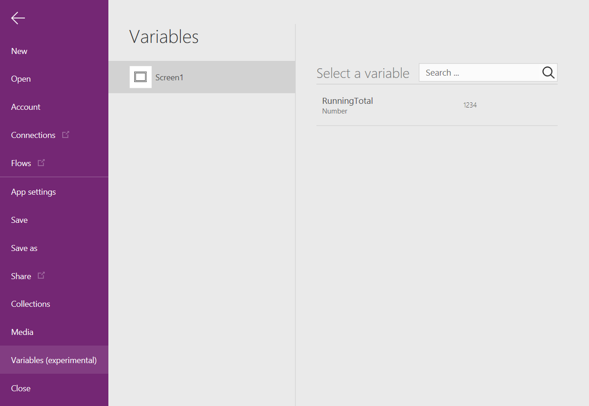
9. Selecteer deze als u wilt zien waar uw contextvariabele is gedefinieerd en gebruikt.
   
    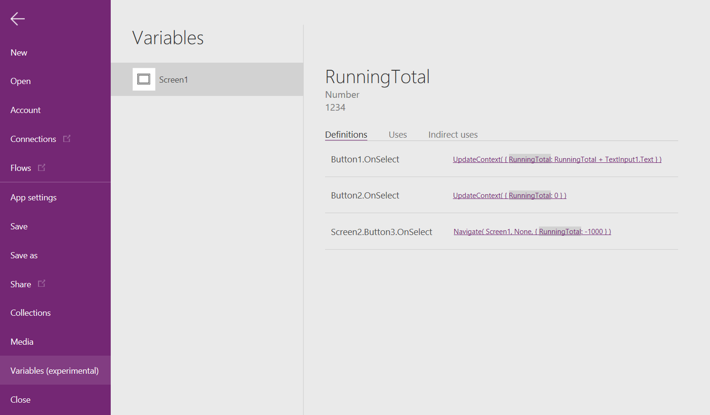

## Een verzameling maken
Ten slotte bekijken we het maken van onze optelsom met een verzameling.  Omdat een verzameling een tabel bevat die gemakkelijk te wijzigen is, zorgen we dat deze optelsom een 'papieren strook' bijhoudt van elke waarde die wordt ingevoerd.

Hoe verzamelingen werken:

* Verzamelingen kunt u maken en instellen met behulp van de functie **[ClearCollect](functions/function-clear-collect-clearcollect.md)**.  U kunt in plaats daarvan de functie **[Collect](functions/function-clear-collect-clearcollect.md)** gebruiken, maar hiervoor is een andere variabele nodig; de oude kan niet worden vervangen.  
* Een verzameling is een soort gegevensbron en daarom een tabel. Voor toegang tot een enkele waarde in een verzameling gebruikt u de functie **[First](functions/function-first-last.md)** en extraheert u één veld uit de resulterende record. Als u één waarde hebt gebruikt met **[ClearCollect](functions/function-clear-collect-clearcollect.md)**, wordt dit het veld **Value**, zoals in dit voorbeeld: **First(** *VariableName* **).Value**

Laten we onze optelsom opnieuw maken met behulp van een verzameling:

1. Voeg een **[tekstinvoer](controls/control-text-input.md)**besturingselement met de naam **Tekstinvoer1** en twee knoppen met de naam **Knop1** en **Knop2** toe.

2. Stel de **[tekst](controls/properties-core.md)**eigenschap van **Knop1** in op **"Optellen"** en stel de **tekst**eigenschap van **Knop2** in op **"Wissen"**.

3. Als het voorlopige totaal moet worden bijgewerkt wanneer een gebruiker de knop **Optellen** selecteert, stelt u de eigenschap **[OnSelect](controls/properties-core.md)** in op deze formule:
   
    **Collect( PaperTape, TextInput1.Text )**
   
    Deze formule voegt de nieuwe waarde toe aan het einde van de verzameling.  Omdat we een enkele waarde toevoegen, plaatst de functie **Collect** deze automatisch in een tabel met één kolom met de kolomnaam **Value** die we later gebruiken.
   
    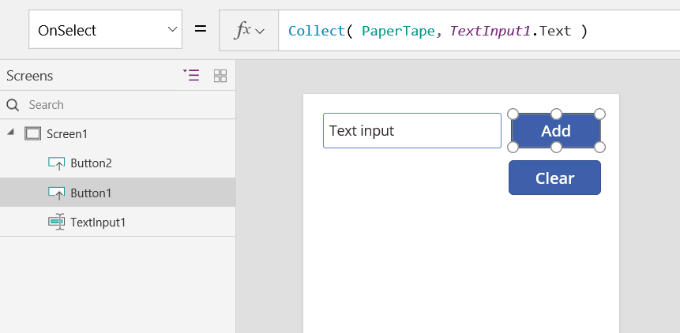
4. Om de papieren strook te wissen wanneer de gebruiker de knop **Wissen** selecteert, stelt u de eigenschap **[OnSelect](controls/properties-core.md)** in op deze formule:
   
    **Clear( PaperTape )**
   
    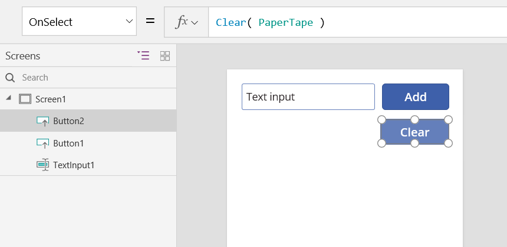
5. Als u het voorlopige totaal wilt weergeven, voegt u een label toe en stelt u de eigenschap **[Text](controls/properties-core.md)** ervan in op deze formule:
   
    **Sum( PaperTape, Value )**
   
    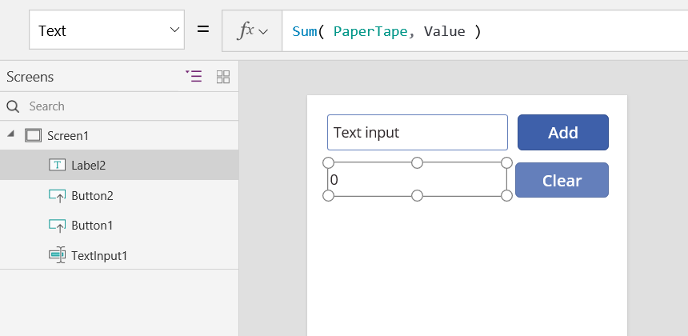
6. Als u de optelsom wilt uitvoeren, drukt u op F5 om het voorbeeld te openen, voert u in het tekstinvoerbesturingselement getallen in en selecteert u knoppen.
   
    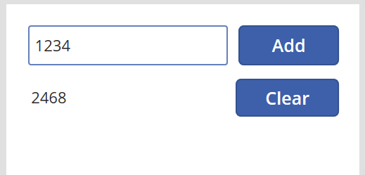
7. Druk op Esc om terug te gaan naar de standaardwerkruimte.
8. Als u de papieren strook wilt weergeven, voegt u een besturingselement **Gegevenstabel** in en stelt u de eigenschap **[Items](controls/properties-core.md)** in op deze formule:
   
    **PaperTape**
   
    U moet ook de kolommen selecteren om weer te geven in het rechterdeelvenster, in ons geval wordt de kolom **Value** weergeven:
   
    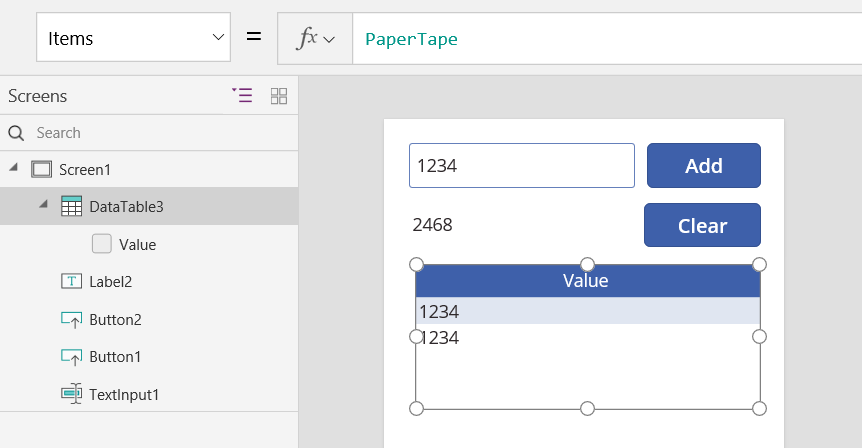
9. Als u de waarden in uw verzameling wilt bekijken, selecteert u **Verzamelingen** in het menu **Bestand**.
   
    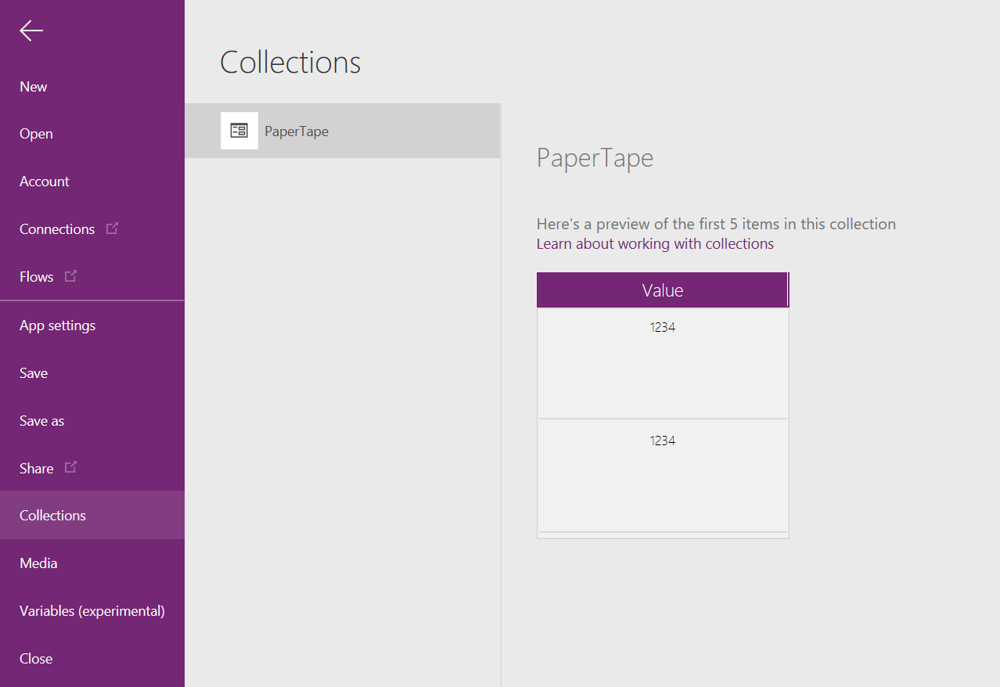
10. Als u uw verzameling wilt opslaan en ophalen, voegt u twee extra knopbesturingselementen toe en stelt u hun tekst in op **Laden** en **Opslaan**.  Stel de eigenschap **OnSelect** voor **Laden** in op:
    
     **Clear( PaperTape ); LoadData( PaperTape, "StoredPaperTape", true )**
    
     We moeten de verzameling eest wissen, omdat **LoadData** de opgeslagen waarden toevoegt aan het einde van de verzameling.
    
     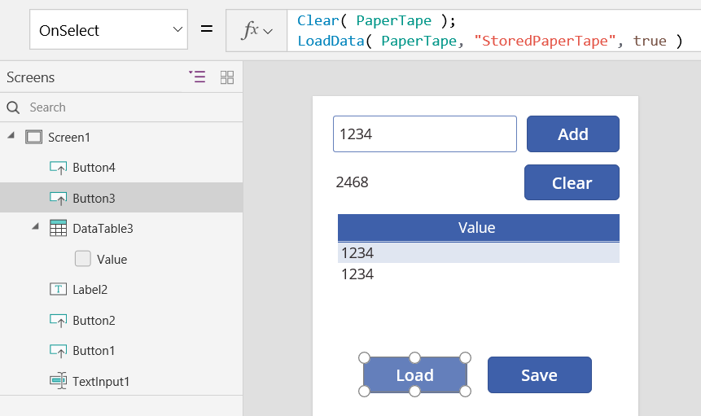
11. Stel de eigenschap **OnSelect** voor **Opslaan** in op:
    
     **SaveData( PaperTape, "StoredPaperTape" )**
    
     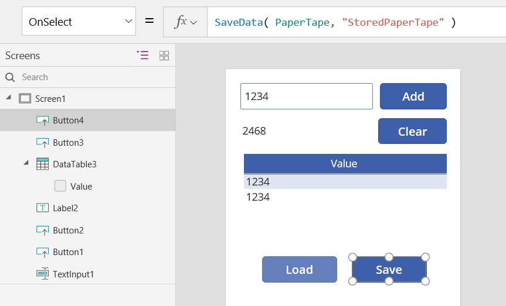
12. Bekijk het opnieuw door op de toets F5 te drukken, getallen in het tekstinvoerbesturingselement in te voeren en knoppen te selecteren.  Selecteer de knop **Opslaan**.  Sluit uw app, start deze opnieuw en selecteer de knop **Laden** om uw verzameling opnieuw te laden.  
    
    > [!NOTE]
    > **SaveData** en **LoadData** werken niet bij uitvoering in een webbrowser. U moet de studio gebruiken die op Windows of een van de spelers voor mobiele apparaten is geïnstalleerd.  

